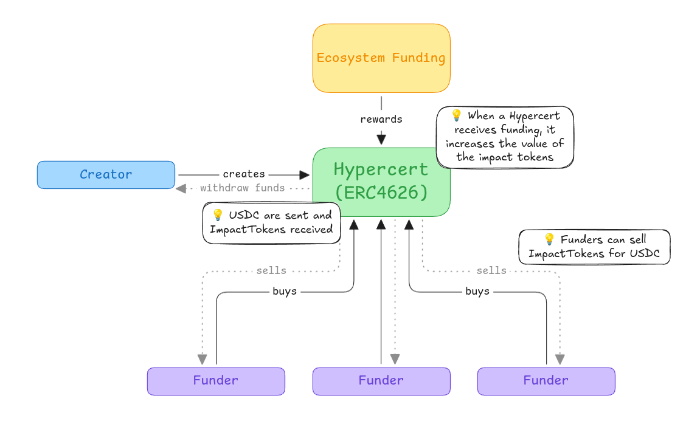
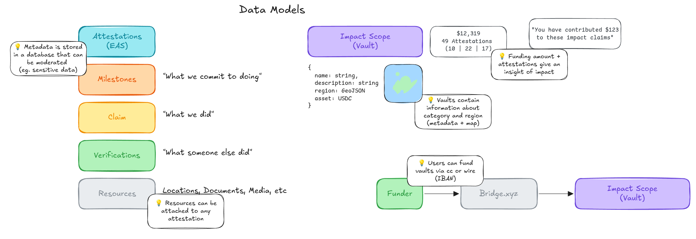
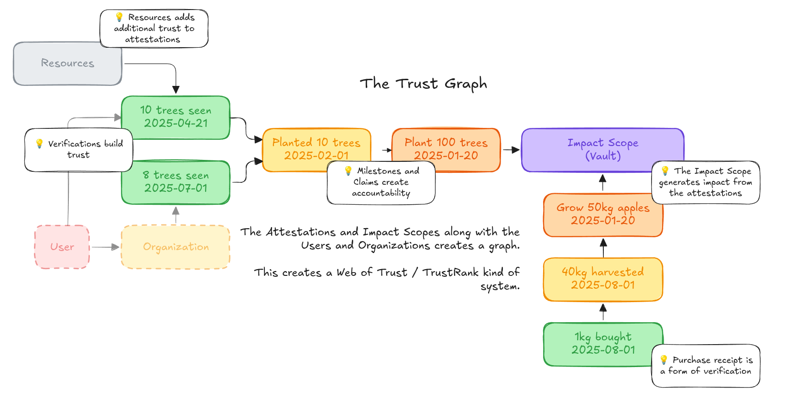

# Hypercerts v.2: A Framework for Impact Attribution and Funding

# Abstract

Public goods funding faces a fundamental attribution problem: how to fairly reward contributors for impact that is non-excludable, non-rivalrous, and often emerges through complex collaboration networks. Existing mechanisms—from grants to retroactive funding programs—struggle to scale attribution across large ecosystems while maintaining transparency and preventing gaming.

We present Hypercerts v.2, a comprehensive framework that combines tokenized project vaults, decentralized attestation systems, and automated impact evaluation to enable scalable retrospective funding. Our architecture integrates three key innovations: (1) ERC4626 vaults that align early funders with long-term project success through shared upside mechanisms, (2) a hybrid on-chain/off-chain (public and private) attestation system using the Ethereum Attestation Service (EAS), and (3) a configurable hybrid PageRank algorithm that attributes impact across networks of agents, artifacts, and outcomes.

The system models contributions as a directed weighted graph where agents (contributors) create artifacts (code, papers, designs) that generate outcomes (funding, citations, usage). Our hybrid attribution algorithm combines forward influence propagation with reverse credit flow, balanced by community-configurable parameters that encode domain-specific value systems. This enables automated reward distribution while preserving human judgment in weight setting and evaluation quality.

We demonstrate the framework's applicability across diverse domains including scientific research, environmental projects, open-source software, and creative industries. The architecture supports both public transparency through on-chain attestations and privacy through off-chain storage, with semantic similarity detection to prevent duplicate claims and gaming.

Hypercerts v.2 provides a scalable, interoperable foundation for impact funding that could transform how we coordinate and incentivize work on public and common goods. By automating attribution while preserving community governance, the system enables retrospective funding at unprecedented scale while maintaining the flexibility to adapt to domain-specific needs and evolving value systems.

---

# 1. Introduction

## 1.1 The Public Goods Funding Problem

Public goods—from scientific research and open-source software to environmental conservation and artistic works—suffer from chronic underfunding due to their non-excludable and non-rivalrous nature. Contributors cannot easily capture the value they create, leading to market failures where socially beneficial work remains under-incentivized. Traditional funding mechanisms attempt to address this through grants, donations, and philanthropic support, but these approaches face fundamental limitations.

**Attribution Complexity**: Most impactful work emerges from complex networks of collaboration, building on prior contributions, and involving both visible and hidden contributors. A breakthrough scientific paper may depend on dozens of prior works, infrastructure maintained by volunteers, and peer reviewers who remain anonymous. Current funding systems struggle to fairly attribute and reward all participants in these contribution networks.

**Scaling Challenges**: Expert-driven evaluation, while high-quality, cannot scale to evaluate the thousands of projects and millions of contributors in modern digital ecosystems. Manual review processes create bottlenecks and introduce subjective biases that may systematically under-reward certain types of contributions or contributors.

**Temporal Misalignment**: The value of public goods often becomes apparent only after significant time delays. A mathematical proof may take decades to find practical applications; an environmental conservation project may show benefits only over generational timescales. Traditional funding requires predictions about future impact, but these predictions are notoriously unreliable.

**Gaming and Verification**: Any funding system creates incentives for strategic behavior. Contributors may inflate their contributions, duplicate claims across networks, or engage in collusive evaluation. Verifying the authenticity and uniqueness of impact claims becomes increasingly difficult as systems scale.


_Figure 1: High-level system overview showing the integration of EAS attestations, Ponder indexing, ERC4626 vaults, and attribution algorithms_

## 1.2 Vision: Hypercerts v.2

Hypercerts v.2 addresses these challenges through a comprehensive framework that separates funding, attestation, evaluation, and reward distribution into modular, interoperable components. The system builds on the foundational concept of hypercerts: tokens that encode claims about work and impact, while introducing novel mechanisms for automated attribution and retrospective reward distribution.

**Key Innovations**:

1. **Tokenized Project Vaults**: ERC4626-compliant vaults represent projects as tokenized entities where shares can be minted to different stakeholder classes (contributors, early funders, stewards). This creates aligned incentives where early risk-taking is rewarded through upside participation in future funding rounds.

2. **Hybrid Attestation System**: Combines the transparency of on-chain Ethereum Attestation Service (EAS) records with the privacy and flexibility of off-chain storage. Contributors can create private draft attestations, collaborate on verification, and selectively publish to the public chain.

3. **Automated Impact Attribution**: A configurable hybrid PageRank algorithm analyzes networks of contributions to automatically distribute attribution scores. The algorithm combines forward influence propagation (rewarding structural importance) with reverse credit flow (emphasizing proximity to valued outcomes).

4. **Multi-chain Integration**: Ponder-based indexing aggregates data across multiple blockchains while creating semantic embeddings for duplicate detection and similarity search as well as spatial queries for location-based impact verification.


_Figure 2: ERC4626 vault structure showing multi-stakeholder share classes and value accrual mechanisms_

**Alignment with Retrospective Funding**: Unlike traditional grants that fund promises, Hypercerts v.2 emphasizes retrospective funding—rewarding work after its impact has been demonstrated. However, the tokenized vault structure ensures that early supporters can still participate in upside, addressing the capital formation challenges that pure retrospective systems face.

## 1.3 Theoretical Foundation

The system implements the Generalized Impact Evaluators (GIE) framework, which formalizes impact funding as a tuple IE = {r, e, m, S} where:

- **Scope (S)** defines the entities and relationships under consideration
- **Measurement (m)** collects data about contributions and outcomes
- **Evaluation (e)** computes relative importance scores
- **Reward (r)** distributes resources proportionally

By making these components explicit and modular, Hypercerts v.2 enables different stakeholders to specialize: data providers focus on measurement quality, algorithm designers optimize evaluation methods, and funding organizations manage reward distribution. This separation of concerns allows the system to evolve and adapt while maintaining interoperability.

## 1.4 Paper Contributions

This paper makes several key contributions:

**Technical Architecture**: We present the complete technical specification for Hypercerts v.2, including smart contract interfaces, data schemas, and integration protocols. This provides a concrete implementation path for the theoretical GIE framework.

**Hybrid Attribution Algorithm**: We develop a novel hybrid PageRank algorithm that combines structural network analysis with outcome-based attribution, enabling communities to configure evaluation parameters to reflect their specific value systems.

**Privacy-Preserving Attestation**: We design a graduated transparency system where sensitive work claims can be developed privately before selective public disclosure, addressing real-world needs for confidentiality in competitive research and commercial applications.

**Empirical Applications**: We analyze concrete use cases across scientific research, environmental projects, open-source software, and creative industries, demonstrating the framework's broad applicability while identifying domain-specific adaptation requirements.

**Implementation Framework**: We provide detailed implementation considerations including gaming resistance mechanisms, privacy trade-offs, governance structures, and adoption strategies necessary for real-world deployment.

The result is a comprehensive system that could transform how we fund and coordinate work on public goods, enabling retrospective funding at unprecedented scale while preserving the human judgment and community governance necessary for legitimacy and adaptation.

---

# 2. Related Work

## 2.1 Impact Funding Mechanisms

### 2.1.1 Quadratic Funding and Liberal Radicalism

Quadratic funding, introduced by Buterin, Hitzig, and Weyl (2018), addresses the public goods funding problem by using matching funds to amplify small donations while limiting the influence of large donors. The mechanism allocates matching funds proportional to the square of the sum of square roots of individual contributions, theoretically optimizing for community preference while mitigating plutocratic influence.

Gitcoin has implemented quadratic funding at scale, distributing millions of dollars to open-source projects and demonstrating both the potential and limitations of the approach. Key challenges include Sybil resistance (preventing fake identities from gaming the matching algorithm), collusion detection, and the need for trusted matching fund sources. While effective for distributing existing pools of capital, quadratic funding does not directly address the attribution problem—determining which specific contributors deserve rewards for observed impact.

### 2.1.2 Retroactive Public Goods Funding (RetroPGF)

The Optimism Collective pioneered Retroactive Public Goods Funding, distributing over $30 million across multiple rounds based on demonstrated impact rather than future promises. RetroPGF programs use expert voting panels to evaluate projects after impact has been observed, addressing the temporal misalignment problem inherent in prospective funding.

However, recent research by Yu et al. (2025) identifies significant vulnerabilities in voting-based RetroPGF systems, including strategic manipulation, voting coordination attacks, and the difficulty of scaling expert evaluation. Their analysis of Optimism's RetroPGF rounds reveals that voting mechanisms can be gamed through strategic project timing, voter coordination, and the exploitation of information asymmetries between evaluators and project participants.

These findings highlight the need for automated evaluation mechanisms that can scale while preserving the core insight of retrospective funding—that impact should be rewarded after it is demonstrated rather than before it is promised.

### 2.1.3 Generalized Impact Evaluators Framework

Network Goods (2023) formalized the concept of Generalized Impact Evaluators (GIE) as modular systems for coordinating work through measurement, evaluation, and reward distribution. The GIE framework defines impact evaluators as tuples IE = {r, e, m, S} where each component can be independently optimized and composed with other system components.

This modularity enables specialization: measurement systems can focus on data quality and coverage, evaluation algorithms can optimize for fairness and accuracy, and reward mechanisms can adapt to different economic models and stakeholder preferences. The framework provides the theoretical foundation for Hypercerts v.2's architectural separation of concerns.

However, the GIE framework primarily addresses the theoretical structure of impact evaluation without providing concrete implementations or addressing practical challenges like gaming resistance, privacy preservation, and adoption incentives. Our work contributes a complete implementation of the GIE framework with specific solutions for these practical challenges.

## 2.2 Attribution and Evaluation Systems

### 2.2.1 Citation Networks and Academic Attribution

Academic citation networks provide one of the most mature examples of large-scale attribution systems. Citation analysis algorithms, from simple citation counts to sophisticated measures like the h-index and PageRank-based eigenfactor scores, attempt to quantify research impact by analyzing networks of scholarly references.

However, academic attribution faces well-documented challenges: citation practices vary across disciplines, self-citation and citation cartels can game metrics, and important contributions like peer review, data collection, and infrastructure maintenance remain invisible in citation networks. These challenges parallel those faced by any large-scale attribution system and inform the design of Hypercerts v.2's gaming resistance mechanisms.

The success of citation-based systems despite these limitations demonstrates that network-based attribution can function at scale when supported by appropriate social norms and institutional structures. Academic institutions have developed practices around citation ethics, peer review processes, and reputation systems that could inform governance mechanisms for decentralized attribution systems.

### 2.2.2 PageRank and Network Centrality

PageRank, developed by Page, Brin, Motwani, and Winograd (1999) for web search, computes node importance in directed graphs by recursively defining a node's importance as proportional to the importance of nodes that link to it. The algorithm's success in web search demonstrates the power of network-based importance measures for large-scale evaluation.

Extensions of PageRank include personalized PageRank (which biases random walks toward specific starting nodes), topic-sensitive PageRank (which adapts importance scores to query contexts), and various centrality measures like eigenvector centrality and HITS (Hyperlink-Induced Topic Search). These extensions provide theoretical foundations for adapting PageRank to the specific requirements of impact attribution.

Our hybrid PageRank algorithm extends this work by combining forward influence propagation with reverse credit attribution, enabling the same graph structure to support both "effort-based" evaluation (rewarding structural importance) and "outcome-based" evaluation (emphasizing proximity to demonstrated value). The configurable balance between these modes allows communities to encode their specific value systems into the attribution algorithm.

### 2.2.3 Decentralized Attestation Systems

The Ethereum Attestation Service (EAS) provides infrastructure for creating and verifying arbitrary attestations on-chain. EAS enables anyone to create attestation schemas, make attestations against those schemas, and compose attestations into complex verification workflows. This provides the foundational infrastructure for verifiable impact claims.

However, pure on-chain attestation faces challenges around privacy (all attestations are public), cost (gas fees for each attestation), and flexibility (difficulty updating or retracting attestations). Off-chain attestation systems address these challenges but sacrifice verifiability and composability. Our hybrid approach combines the benefits of both systems through EAS's unified on-chain/off-chain attestation model.

Similar hybrid approaches appear in other decentralized systems: Git combines local repositories with distributed synchronization, and blockchain systems often use off-chain scaling solutions with periodic on-chain settlement. The pattern of local flexibility with global verifiability appears broadly applicable to decentralized coordination systems.

---

# 3. System Architecture


_Figure 3: Core data models showing relationships between agents, artifacts, outcomes, and attestations_

## 3.1 Architectural Overview

Hypercerts v.2 implements a three-layer architecture that separates data persistence, business logic, and user interfaces while enabling interoperability across blockchain networks and storage systems. This design allows different components to evolve independently while maintaining system coherence and enabling specialized optimization of each layer.

```
┌─────────────────────────────────────────────────────────────┐
│                    Interface Layer                          │
│  Attestation Creation • Funding UI • Governance Tools      │
└─────────────────────────────────────────────────────────────┘
                                │
┌─────────────────────────────────────────────────────────────┐
│                     Logic Layer                             │
│  ERC4626 Vaults • Smart Accounts • Attribution Engine      │
└─────────────────────────────────────────────────────────────┘
                                │
┌─────────────────────────────────────────────────────────────┐
│                     Data Layer                              │
│  Ponder Indexer • EAS Attestations • IPFS Storage         │
└─────────────────────────────────────────────────────────────┘
```

The architecture implements the Generalized Impact Evaluator framework by distributing its functions across these layers: measurement occurs primarily in the data layer, evaluation in the logic layer, and reward distribution through the combination of logic and interface layers. The scope function spans all layers through filtering and access control mechanisms.

## 3.2 Data Layer Architecture

### 3.2.1 Unified Data Architecture

**Ponder Indexer as Central Database**: Ponder serves as the primary data layer, indexing and normalizing data from multiple sources into a unified PostgreSQL database. This eliminates architectural complexity by having a single source of truth while maintaining data sovereignty across different networks.

**EAS Integration**: Both on-chain and off-chain EAS attestations are indexed by Ponder, which normalizes their different formats into consistent database schemas. This creates a unified view of:

- On-chain attestations (permanent, transparent, higher gas cost)
- Off-chain attestations (flexible, private, lower cost)
- Cross-chain attestations from multiple networks

**IPFS with Storacha**: Provides decentralized storage for attestation metadata, project documentation, and supporting evidence. The content-addressable nature of IPFS ensures data integrity while Storacha's incentive layer provides persistence guarantees. Project vaults include IPFS hash metadata fields that point to detailed project descriptions, contribution guidelines, and evaluation criteria.

### 3.2.2 Simplified Data Flow

**Unified Indexing**: Ponder eliminates architectural complexity by serving as the single data normalization layer:

1. **Data Creation**: Attestations created via EAS (on-chain or off-chain), funding events into ERC4626 vaults, User or Organization Smart Accounts
2. **Data Indexing**: Ponder monitors and indexes all EAS attestations plus blockchain events across multiple networks
3. **Data Normalization**: Ponder transforms diverse attestation schemas and transaction data into unified graph structures
4. **Graph Construction**: Attribution algorithms operate directly on the normalized Ponder database

**Cross-chain Identity**: Smart accounts serve as canonical identity anchors that can operate across multiple blockchain networks. Using account abstraction standards, contributors maintain consistent identities regardless of which network they interact with, enabling attribution that spans chain boundaries.

**Spatial Data Support**: The indexer includes PostGIS extensions for handling geospatial data, enabling location-based impact verification for environmental and social projects. GeoJSON data attached to attestations can support queries like "all forest restoration projects within 100km of this location" or "carbon offset projects in tropical regions."

### 3.2.3 Semantic Search and Duplicate Detection

**Embedding Generation**: The system generates vector embeddings for attestation text using transformer-based language models. These embeddings enable semantic similarity search and help identify potentially duplicate or related claims across different projects and contributors.

## 3.3 Logic Layer Architecture

### 3.3.1 ERC4626 Vault System

**Tokenized Project Representation**: Each project is represented as an ERC4626 vault that holds assets and manages shares representing different forms of ownership and participation. This standard interface enables composability with existing DeFi infrastructure while providing project-specific customization.

**Multi-class Share Structure**: Vaults support different share classes with distinct rights and characteristics:

- **Contributor shares**: Minted to contributors based on verified work claims
- **Steward shares**: Allocated to project maintainers and governance participants
- **Founder shares**: Reserved for project initiators with potential vesting schedules
- **Investor shares**: Purchased by early funders through deposit mechanisms

### 3.3.2 Smart Account Integration

**Canonical Identity System**: Each participant maintains a smart account that serves as their canonical identity across the system. These accounts integrate with existing identity providers while maintaining sovereignty and portability.

**Multi-signature and Role-based Access**: Organizations can deploy multi-signature smart accounts with role-based permissions using Zodiac modules. This enables complex governance structures while maintaining security and accountability. The smart contract also includes a Metadata module that contains information about the organizations (this is picked up by the Ponder indexer).

**Cross-platform Compatibility**: Smart accounts implement account abstraction standards that enable operation across different blockchain networks and integration with traditional systems through API bridges.

### 3.3.3 Attestation Processing Engine

**Schema Validation**: Enforces standardized schemas for different types of attestations while enabling community-specific extensions. Core schemas include work milestones and claims, verifications and evaluations, endorsements and reviews, and resources like media and documents pointing to work claim and evaluation attestations.

**Privacy Controls**: Manages access permissions for different attestation visibility levels:

- **Private**: Visible only to attestation creator and explicitly authorized parties
- **Organizational**: Visible within specific organizations or project boundaries
- **Public Draft**: Visible to community for review and comment before publication
- **Published**: Permanently published to EAS with full transparency

## 3.4 Attribution and Evaluation Architecture

### 3.4.1 EAS-Based Graph Construction

**Attestation-Driven Node Creation**: The system extracts graph nodes directly from EAS attestations indexed by Ponder:

- **Agents**: Contributors, evaluators, and organizations referenced in attestations
- **Artifacts**: Projects, repositories, papers, and works claimed or evaluated
- **Outcomes**: Funding events, grants, citations, and impact measurements

**Graph Edges from Attestation Types**: Relationships are derived from standardized EAS attestation schemas:

- **Work Claims**: Agent → Artifact (contribution relationships)
- **Evaluations**: Outcome → Artifact (impact valuation)
- **Endorsements**: Agent → Agent (trust and reputation)
- **Funding Events**: Outcome → Vault (financial flows)
- **Dependencies**: Artifact → Artifact (building upon prior work)


_Figure 5: Trust and reputation graph showing how endorsement attestations create networks of credibility_

**Weight Calculation**: Edge weights combine multiple factors:

- Attestation confidence scores provided by creators
- Community verification status and reputation
- Temporal decay functions for aging contributions
- Domain-specific multipliers for different edge types

### 3.4.2 Hybrid PageRank Implementation

**Forward Pass**: Computes structural importance by running standard PageRank on the contribution graph. This rewards agents and artifacts that are well-connected and serve as hubs in the contribution network, regardless of outcome realization.

**Reverse Pass**: Reverses edges from outcome nodes and runs personalized PageRank with outcomes as personalization seeds. This propagates credit backward from demonstrated value to the agents and artifacts that contributed to that value.

**Hybrid Combination**: Final scores combine forward and reverse rankings using a configurable balance parameter α:

```
Score(agent) = α × Forward_Score(agent) + (1-α) × Reverse_Score(agent)
```

**Configuration Management**: Communities can adjust evaluation parameters through governance mechanisms:

- Balance parameter α (structural vs. outcome emphasis)
- Edge type multipliers (relative importance of different contribution types)
- Temporal decay rates (how quickly old contributions lose weight)
- Personalization vectors (which outcomes to emphasize)

---

# 4. Funding Mechanics

## 4.1 Vault-Based Project Funding Model

### 4.1.1 ERC4626 Vault Structure

Hypercerts v.2 represents each project as an ERC4626-compliant vault that serves as both a funding vehicle and a coordination mechanism. Unlike traditional project funding where capital flows directly to project accounts, the vault structure creates a persistent entity that can accumulate value over time while maintaining transparent governance and accountability.

**Asset Management**: Vaults hold a pair of ERC20 tokens (assets and shares). The standardized ERC4626 interface ensures compatibility with existing DeFi infrastructure while enabling project-specific customization of deposit and withdrawal mechanics.

**Share Token Economics**: Vault shares represent proportional ownership in the project's accumulated value and future cash flows. The total value of shares increases through multiple mechanisms:

- Grant deposits that add assets without minting new shares
- Revenue generation from project usage or licensing
- Retrospective funding based on demonstrated impact
- Secondary market appreciation of vault shares

**Metadata Integration**: Each vault includes IPFS metadata hashes that point to details about the project such as name, description, its geographic location, and its intended impact.

### 4.1.2 Multi-Stakeholder Share Classes

The vault system supports differentiated share classes that align different stakeholder incentives while maintaining overall project coherence:

**Contributor Shares**: Minted to individuals and organizations based on verified work contributions. These shares carry both economic rights (proportional reward distribution) and governance rights (voting on project direction).

**Early Funder Shares**: Purchased by investors and supporters through the vault's deposit mechanism. Early funders provide essential capital for project initiation and operation while receiving potential upside through share appreciation. Key features include:

- **Risk-adjusted pricing**: Share prices may reflect project risk and development stage
- **Vesting schedules**: Shares may vest over time to encourage long-term alignment
- **Liquidity mechanisms**: Secondary markets enable early funders to exit while preserving project continuity

**Founder Shares**: Reserved for project initiators with potential vesting schedules that align founder incentives with long-term project success.

### 4.1.3 Value Accrual and Distribution

**Grant Integration**: Traditional grants can fund vault operations without diluting existing shareholders by depositing assets directly into the vault. This increases the net asset value per share while preserving the proportional ownership structure. Grant providers may:

- Specify how funds should be allocated across different project activities
- Require reporting on fund usage and impact achievement
- Establish milestone-based disbursement schedules
- Retain governance rights proportional to their funding contribution

**Revenue Capture**: Projects that generate revenue through licensing, services, or product sales can direct these funds to the vault, benefiting all stakeholders proportionally.

**Retrospective Funding Integration**: When external retrospective funding programs (like Optimism RetroPGF or private foundation grants) reward projects, these funds flow to vaults and increase share value. The automated attribution system can provide evidence for funding applications and distribute awards appropriately among contributors.

## 4.2 Stakeholder Incentive Alignment

### 4.2.1 Early Funder Reward Mechanisms

Early funders face significant risk when supporting projects with uncertain outcomes. The vault structure addresses this through several mechanisms that provide upside participation while protecting against total loss:

**Shared Upside**: When projects receive grants, achieve adoption milestones, or generate revenue, early funders benefit through share appreciation rather than just receiving reports on fund usage. This creates incentive alignment between funders and projects.

**Risk Diversification**: Funders can purchase shares in multiple project vaults, creating portfolio effects that reduce overall risk while maintaining exposure to high-potential projects.

**Secondary Markets**: Share transferability enables early funders to exit positions as projects mature and risk profiles change, providing liquidity that traditional grant funding lacks.

**Governance Participation**: Early funders receive voting rights proportional to their share ownership, enabling them to influence project direction and protect their investments through active governance participation.

### 4.2.2 Contributor Incentive Structures

Contributors need assurance that their efforts will be fairly recognized and rewarded, particularly for high-risk, high-impact work that may not show immediate results:

**Immediate Recognition**: Contributor shares are minted based on verified work claims, providing immediate tokenization of contributions even before impact is fully realized.

**Long-term Upside**: As projects succeed and attract funding, contributor shares appreciate in value, ensuring that contributors benefit from the long-term success of their work.

**Cross-project Attribution**: The global attribution system enables contributors to receive recognition and rewards for infrastructure work that benefits multiple projects, addressing the underinvestment problem in shared resources.

**Reputation Building**: Verified contributions and successful project outcomes build contributor reputation scores that influence future share allocations and funding opportunities.

### 4.2.3 Grant Provider Value Proposition

Traditional grant providers (foundations, governments, DAOs) gain several advantages from integrating with the vault system:

**Increased Impact Leverage**: Grant funds that increase vault value benefit all stakeholders, creating multiplicative effects where grant funds attract additional investment and contributor effort.

**Transparent Impact Tracking**: The integrated attribution and evaluation system provides grant providers with detailed evidence of fund usage and impact achievement, addressing accountability requirements.

**Reduced Due Diligence Costs**: Standardized project vaults with consistent reporting and evaluation mechanisms reduce the cost and complexity of grant evaluation and monitoring.

**Portfolio Management**: Grant providers can maintain ongoing relationships with funded projects through share ownership rather than terminating involvement after grant disbursement.

---
