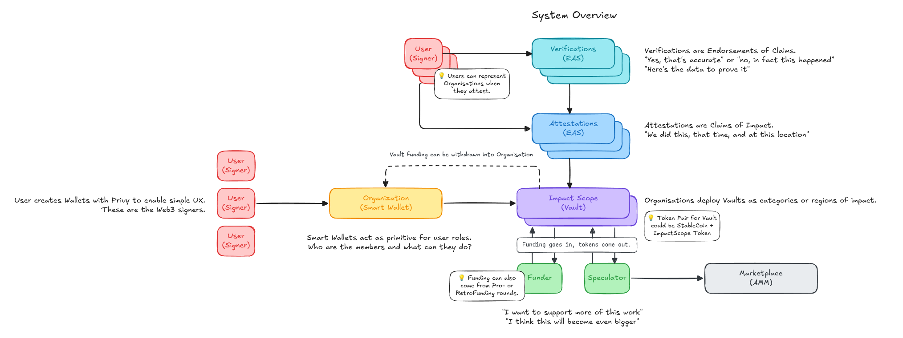
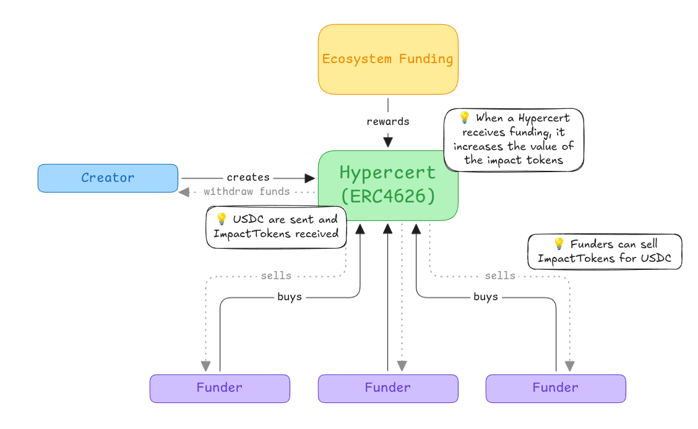
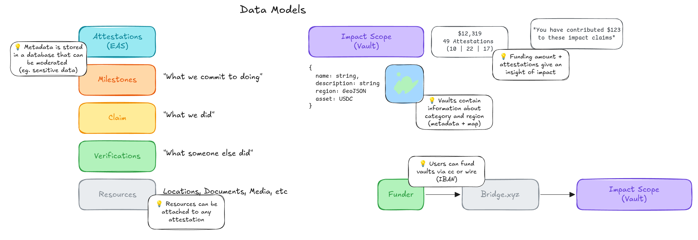
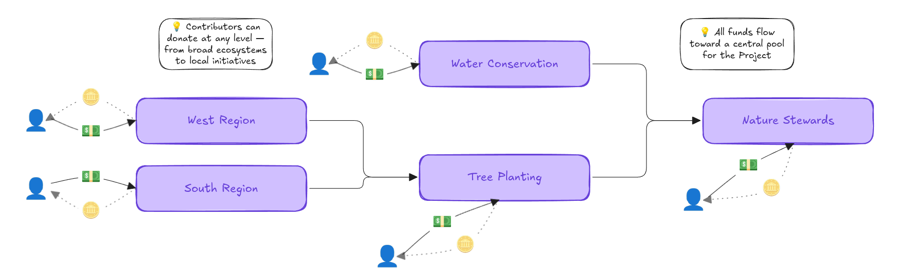
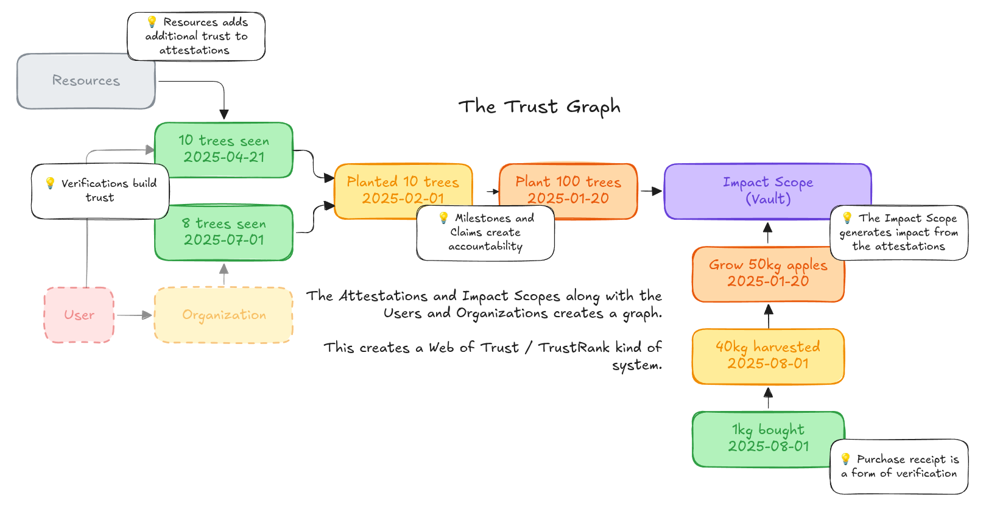
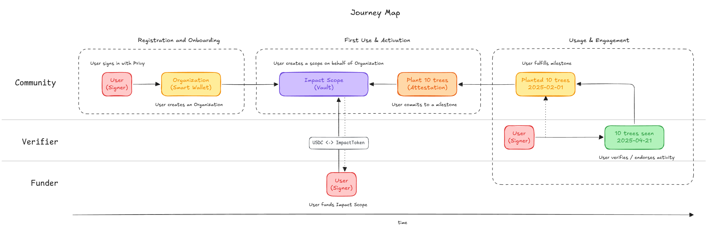
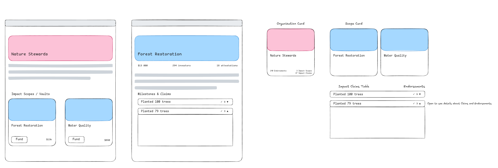

# Hypercerts v.2: A Comprehensive Framework for Impact Attribution and Funding

**Authors**: [To be determined]
**Date**: December 2024
**Version**: 1.0 Complete Draft

---

# Abstract

Public goods funding faces a fundamental attribution problem: how to fairly reward contributors for impact that is non-excludable, non-rivalrous, and often emerges through complex collaboration networks. Existing mechanisms—from grants to retroactive funding programs—struggle to scale attribution across large ecosystems while maintaining transparency and preventing gaming.

We present Hypercerts v.2, a comprehensive framework that combines tokenized project vaults, decentralized attestation systems, and automated impact evaluation to enable scalable retrospective funding. Our architecture integrates three key innovations: (1) ERC4626 vaults that align early funders with long-term project success through shared upside mechanisms, (2) a hybrid on-chain/off-chain attestation system using the Ethereum Attestation Service (EAS) with Ponder indexing for unified data management, and (3) a configurable hybrid PageRank algorithm that attributes impact across networks of agents, artifacts, and outcomes.

The system models contributions as a directed weighted graph where agents (contributors) create artifacts (code, papers, designs) that generate outcomes (funding, citations, usage). Our hybrid attribution algorithm combines forward influence propagation with reverse credit flow, balanced by community-configurable parameters that encode domain-specific value systems. This enables automated reward distribution while preserving human judgment in weight setting and evaluation quality.

We demonstrate the framework's applicability across diverse domains including scientific research, environmental projects, open-source software, and creative industries. The architecture supports both public transparency through on-chain attestations and privacy through off-chain storage, with semantic similarity detection to prevent duplicate claims and gaming.

Hypercerts v.2 provides a scalable, interoperable foundation for impact funding that could transform how we coordinate and incentivize work on public and common goods. By automating attribution while preserving community governance, the system enables retrospective funding at unprecedented scale while maintaining the flexibility to adapt to domain-specific needs and evolving value systems.

---

# 1. Introduction

## 1.1 The Public Goods Funding Problem

Public goods—from scientific research and open-source software to environmental conservation and artistic works—suffer from chronic underfunding due to their non-excludable and non-rivalrous nature. Contributors cannot easily capture the value they create, leading to market failures where socially beneficial work remains under-incentivized. Traditional funding mechanisms attempt to address this through grants, donations, and philanthropic support, but these approaches face fundamental limitations.

**Attribution Complexity**: Most impactful work emerges from complex networks of collaboration, building on prior contributions, and involving both visible and hidden contributors. A breakthrough scientific paper may depend on dozens of prior works, infrastructure maintained by volunteers, and peer reviewers who remain anonymous. Current funding systems struggle to fairly attribute and reward all participants in these contribution networks.

**Scaling Challenges**: Expert-driven evaluation, while high-quality, cannot scale to evaluate the thousands of projects and millions of contributors in modern digital ecosystems. Manual review processes create bottlenecks and introduce subjective biases that may systematically under-reward certain types of contributions or contributors.

**Temporal Misalignment**: The value of public goods often becomes apparent only after significant time delays. A mathematical proof may take decades to find practical applications; an environmental conservation project may show benefits only over generational timescales. Traditional funding requires predictions about future impact, but these predictions are notoriously unreliable.

**Gaming and Verification**: Any funding system creates incentives for strategic behavior. Contributors may inflate their contributions, duplicate claims across platforms, or engage in collusive evaluation. Verifying the authenticity and uniqueness of impact claims becomes increasingly difficult as systems scale.


_Figure 1: High-level system overview showing the integration of EAS attestations, Ponder indexing, ERC4626 vaults, and attribution algorithms_

## 1.2 Vision: Hypercerts v.2

Hypercerts v.2 addresses these challenges through a comprehensive framework that separates funding, attestation, evaluation, and reward distribution into modular, interoperable components. The system builds on the foundational concept of hypercerts—semi-fungible tokens that encode claims about work and impact—while introducing novel mechanisms for automated attribution and retrospective reward distribution.

**Key Innovations**:

1. **Tokenized Project Vaults**: ERC4626-compliant vaults represent projects as tokenized entities where shares can be minted to different stakeholder classes (contributors, early funders, stewards). This creates aligned incentives where early risk-taking is rewarded through upside participation in future funding rounds.

2. **Hybrid Attestation System**: Combines the transparency of on-chain Ethereum Attestation Service (EAS) records with the privacy and flexibility of off-chain storage. Contributors can create private draft attestations, collaborate on verification, and selectively publish to the public chain.

3. **Automated Impact Attribution**: A configurable hybrid PageRank algorithm analyzes networks of contributions to automatically distribute attribution scores. The algorithm combines forward influence propagation (rewarding structural importance) with reverse credit flow (emphasizing proximity to valued outcomes).

4. **Multi-chain Integration**: Ponder-based indexing aggregates data across multiple blockchains while creating semantic embeddings for duplicate detection and spatial queries for location-based impact verification.


_Figure 2: ERC4626 vault structure showing multi-stakeholder share classes and value accrual mechanisms_

**Alignment with Retrospective Funding**: Unlike traditional grants that fund promises, Hypercerts v.2 emphasizes retrospective funding—rewarding work after its impact has been demonstrated. However, the tokenized vault structure ensures that early supporters can still participate in upside, addressing the capital formation challenges that pure retrospective systems face.

## 1.3 Theoretical Foundation

The system implements the Generalized Impact Evaluators (GIE) framework, which formalizes impact funding as a tuple IE = {r, e, m, S} where:

- **Scope (S)** defines the entities and relationships under consideration
- **Measurement (m)** collects data about contributions and outcomes
- **Evaluation (e)** computes relative importance scores
- **Reward (r)** distributes resources proportionally

By making these components explicit and modular, Hypercerts v.2 enables different stakeholders to specialize: data providers focus on measurement quality, algorithm designers optimize evaluation methods, and funding organizations manage reward distribution. This separation of concerns allows the system to evolve and adapt while maintaining interoperability.

## 1.4 Paper Contributions

This paper makes several key contributions:

**Technical Architecture**: We present the complete technical specification for Hypercerts v.2, including smart contract interfaces, data schemas, and integration protocols. This provides a concrete implementation path for the theoretical GIE framework.

**Hybrid Attribution Algorithm**: We develop a novel hybrid PageRank algorithm that combines structural network analysis with outcome-based attribution, enabling communities to configure evaluation parameters to reflect their specific value systems.

**Privacy-Preserving Attestation**: We design a graduated transparency system where sensitive work claims can be developed privately before selective public disclosure, addressing real-world needs for confidentiality in competitive research and commercial applications.

**Empirical Applications**: We analyze concrete use cases across scientific research, environmental projects, open-source software, and creative industries, demonstrating the framework's broad applicability while identifying domain-specific adaptation requirements.

**Implementation Framework**: We provide detailed implementation considerations including gaming resistance mechanisms, privacy trade-offs, governance structures, and adoption strategies necessary for real-world deployment.

The result is a comprehensive system that could transform how we fund and coordinate work on public goods, enabling retrospective funding at unprecedented scale while preserving the human judgment and community governance necessary for legitimacy and adaptation.

---

# 2. Related Work

## 2.1 Impact Funding Mechanisms

### 2.1.1 Quadratic Funding and Liberal Radicalism

Quadratic funding, introduced by Buterin, Hitzig, and Weyl (2018), addresses the public goods funding problem by using matching funds to amplify small donations while limiting the influence of large donors. The mechanism allocates matching funds proportional to the square of the sum of square roots of individual contributions, theoretically optimizing for community preference while mitigating plutocratic influence.

Gitcoin has implemented quadratic funding at scale, distributing millions of dollars to open-source projects and demonstrating both the potential and limitations of the approach. Key challenges include Sybil resistance (preventing fake identities from gaming the matching algorithm), collusion detection, and the need for trusted matching fund sources. While effective for distributing existing pools of capital, quadratic funding does not directly address the attribution problem—determining which specific contributors deserve rewards for observed impact.

### 2.1.2 Retroactive Public Goods Funding (RetroPGF)

The Optimism Collective pioneered Retroactive Public Goods Funding, distributing over $30 million across multiple rounds based on demonstrated impact rather than future promises. RetroPGF programs use expert voting panels to evaluate projects after impact has been observed, addressing the temporal misalignment problem inherent in prospective funding.

However, recent research by Yu et al. (2025) identifies significant vulnerabilities in voting-based RetroPGF systems, including strategic manipulation, voting coordination attacks, and the difficulty of scaling expert evaluation. Their analysis of Optimism's RetroPGF rounds reveals that voting mechanisms can be gamed through strategic project timing, voter coordination, and the exploitation of information asymmetries between evaluators and project participants.

These findings highlight the need for automated evaluation mechanisms that can scale while preserving the core insight of retrospective funding—that impact should be rewarded after it is demonstrated rather than before it is promised.

### 2.1.3 Generalized Impact Evaluators Framework

Network Goods (2023) formalized the concept of Generalized Impact Evaluators (GIE) as modular systems for coordinating work through measurement, evaluation, and reward distribution. The GIE framework defines impact evaluators as tuples IE = {r, e, m, S} where each component can be independently optimized and composed with other system components.

This modularity enables specialization: measurement systems can focus on data quality and coverage, evaluation algorithms can optimize for fairness and accuracy, and reward mechanisms can adapt to different economic models and stakeholder preferences. The framework provides the theoretical foundation for Hypercerts v.2's architectural separation of concerns.

However, the GIE framework primarily addresses the theoretical structure of impact evaluation without providing concrete implementations or addressing practical challenges like gaming resistance, privacy preservation, and adoption incentives. Our work contributes a complete implementation of the GIE framework with specific solutions for these practical challenges.

## 2.2 Attribution and Evaluation Systems

### 2.2.1 Citation Networks and Academic Attribution

Academic citation networks provide one of the most mature examples of large-scale attribution systems. Citation analysis algorithms, from simple citation counts to sophisticated measures like the h-index and PageRank-based eigenfactor scores, attempt to quantify research impact by analyzing networks of scholarly references.

However, academic attribution faces well-documented challenges: citation practices vary across disciplines, self-citation and citation cartels can game metrics, and important contributions like peer review, data collection, and infrastructure maintenance remain invisible in citation networks. These challenges parallel those faced by any large-scale attribution system and inform the design of Hypercerts v.2's gaming resistance mechanisms.

The success of citation-based systems despite these limitations demonstrates that network-based attribution can function at scale when supported by appropriate social norms and institutional structures. Academic institutions have developed practices around citation ethics, peer review processes, and reputation systems that could inform governance mechanisms for decentralized attribution systems.

### 2.2.2 PageRank and Network Centrality

PageRank, developed by Page, Brin, Motwani, and Winograd (1999) for web search, computes node importance in directed graphs by recursively defining a node's importance as proportional to the importance of nodes that link to it. The algorithm's success in web search demonstrates the power of network-based importance measures for large-scale evaluation.

Extensions of PageRank include personalized PageRank (which biases random walks toward specific starting nodes), topic-sensitive PageRank (which adapts importance scores to query contexts), and various centrality measures like eigenvector centrality and HITS (Hyperlink-Induced Topic Search). These extensions provide theoretical foundations for adapting PageRank to the specific requirements of impact attribution.

Our hybrid PageRank algorithm extends this work by combining forward influence propagation with reverse credit attribution, enabling the same graph structure to support both "effort-based" evaluation (rewarding structural importance) and "outcome-based" evaluation (emphasizing proximity to demonstrated value). The configurable balance between these modes allows communities to encode their specific value systems into the attribution algorithm.

### 2.2.3 Decentralized Attestation Systems

The Ethereum Attestation Service (EAS) provides infrastructure for creating and verifying arbitrary attestations on-chain. EAS enables anyone to create attestation schemas, make attestations against those schemas, and compose attestations into complex verification workflows. This provides the foundational infrastructure for verifiable impact claims.

However, pure on-chain attestation faces challenges around privacy (all attestations are public), cost (gas fees for each attestation), and flexibility (difficulty updating or retracting attestations). Off-chain attestation systems address these challenges but sacrifice verifiability and composability. Our hybrid approach combines the benefits of both systems through EAS's unified on-chain/off-chain attestation model.

Similar hybrid approaches appear in other decentralized systems: Git combines local repositories with distributed synchronization, and blockchain systems often use off-chain scaling solutions with periodic on-chain settlement. The pattern of local flexibility with global verifiability appears broadly applicable to decentralized coordination systems.

---

# 3. System Architecture


_Figure 3: Core data models showing relationships between agents, artifacts, outcomes, and attestations_

## 3.1 Architectural Overview

Hypercerts v.2 implements a three-layer architecture that separates data persistence, business logic, and user interfaces while enabling interoperability across blockchain networks and storage systems. This design allows different components to evolve independently while maintaining system coherence and enabling specialized optimization of each layer.

```
┌─────────────────────────────────────────────────────────────┐
│                    Interface Layer                          │
│  Attestation Creation • Funding UI • Governance Tools      │
└─────────────────────────────────────────────────────────────┘
                                │
┌─────────────────────────────────────────────────────────────┐
│                     Logic Layer                             │
│  ERC4626 Vaults • Smart Accounts • Attribution Engine      │
└─────────────────────────────────────────────────────────────┘
                                │
┌─────────────────────────────────────────────────────────────┐
│                     Data Layer                              │
│  Ponder Indexer • EAS Attestations • IPFS Storage         │
└─────────────────────────────────────────────────────────────┘
```

The architecture implements the Generalized Impact Evaluator framework by distributing its functions across these layers: measurement occurs primarily in the data layer, evaluation in the logic layer, and reward distribution through the combination of logic and interface layers. The scope function spans all layers through filtering and access control mechanisms.

## 3.2 Data Layer Architecture

### 3.2.1 Unified Data Architecture

**Ponder Indexer as Central Database**: Ponder serves as the primary data layer, indexing and normalizing data from multiple sources into a unified PostgreSQL database. This eliminates architectural complexity by having a single source of truth while maintaining data sovereignty across different systems.

**EAS Integration**: Both on-chain and off-chain EAS attestations are indexed by Ponder, which normalizes their different formats into consistent database schemas. This creates a unified view of:

- On-chain attestations (permanent, transparent, higher gas cost)
- Off-chain attestations (flexible, private, lower cost)
- Cross-chain attestations from multiple networks

**IPFS with Storacha**: Provides decentralized storage for attestation metadata, project documentation, and supporting evidence. The content-addressable nature of IPFS ensures data integrity while Storacha's incentive layer provides persistence guarantees. Project vaults include IPFS hash metadata fields that point to detailed project descriptions, contribution guidelines, and evaluation criteria.

### 3.2.2 Simplified Data Flow

**Unified Indexing**: Ponder eliminates architectural complexity by serving as the single data normalization layer:

1. **Data Creation**: Attestations created via EAS (on-chain or off-chain), funding events into ERC4626 vaults
2. **Data Indexing**: Ponder monitors and indexes all EAS attestations plus blockchain events across multiple networks
3. **Data Normalization**: Ponder transforms diverse attestation schemas and transaction data into unified graph structures
4. **Graph Construction**: Attribution algorithms operate directly on the normalized Ponder database

**Cross-chain Identity**: Smart accounts serve as canonical identity anchors that can operate across multiple blockchain networks. Using account abstraction standards, contributors maintain consistent identities regardless of which network they interact with, enabling attribution that spans chain boundaries.

**Spatial Data Support**: The indexer includes PostGIS extensions for handling geospatial data, enabling location-based impact verification for environmental and social projects. GeoJSON data attached to attestations can support queries like "all forest restoration projects within 100km of this location" or "carbon offset projects in tropical regions."

### 3.2.3 Semantic Search and Duplicate Detection

**Embedding Generation**: The system generates vector embeddings for attestation text using transformer-based language models. These embeddings enable semantic similarity search and help identify potentially duplicate or related claims across different projects and contributors.

**MinHash and SimHash**: Implements locality-sensitive hashing algorithms to efficiently detect near-duplicate content at scale. MinHash identifies similar sets of contributors or project dependencies, while SimHash detects similar textual descriptions or claims.

**Duplicate Resolution Workflows**: When potential duplicates are detected, the system creates flagged review queues where human evaluators can determine whether claims represent legitimate overlapping work, complementary contributions, or actual gaming attempts. This hybrid automated-human approach balances scale with accuracy.

## 3.3 Logic Layer Architecture

### 3.3.1 ERC4626 Vault System

**Tokenized Project Representation**: Each project is represented as an ERC4626 vault that holds assets and manages shares representing different forms of ownership and participation. This standard interface enables composability with existing DeFi infrastructure while providing project-specific customization.


_Figure 4: Nested vault architecture showing how projects can be composed hierarchically with cross-vault attribution_

**Multi-class Share Structure**: Vaults support different share classes with distinct rights and characteristics:

- **Contributor shares**: Minted to contributors based on verified work claims
- **Steward shares**: Allocated to project maintainers and governance participants
- **Founder shares**: Reserved for project initiators with potential vesting schedules
- **Investor shares**: Purchased by early funders through deposit mechanisms

**Value Accrual Mechanisms**: Vault value increases through multiple channels:

- Grant funding deposited without minting new shares (pure value increase)
- Fee capture from project usage or derivative works
- Retrospective funding allocated based on demonstrated impact
- Secondary market appreciation of vault shares

### 3.3.2 Smart Account Integration

**Canonical Identity System**: Each participant maintains a smart account that serves as their canonical identity across the system. These accounts integrate with existing identity providers while maintaining sovereignty and portability.

**Multi-signature and Role-based Access**: Organizations can deploy multi-signature smart accounts with role-based permissions using Zodiac modules. This enables complex governance structures while maintaining security and accountability. The smart contract also includes a Metadata module that contains information about the organizations (this is picked up by the Ponder indexer).

**Cross-platform Compatibility**: Smart accounts implement account abstraction standards that enable operation across different blockchain networks and integration with traditional systems through API bridges.

### 3.3.3 Attestation Processing Engine

**Schema Validation**: Enforces standardized schemas for different types of attestations while enabling community-specific extensions. Core schemas include work claims, verifications, endorsements, and resource allocations.

**Workflow Management**: Implements state machines for attestation lifecycles, including draft creation, collaborative editing, verification processes, and publication workflows. Different attestation types can follow different approval processes based on their schemas and risk profiles.

**Privacy Controls**: Manages access permissions for different attestation visibility levels:

- **Private**: Visible only to attestation creator and explicitly authorized parties
- **Organizational**: Visible within specific organizations or project boundaries
- **Public Draft**: Visible to community for review and comment before publication
- **Published**: Permanently published to EAS with full transparency

## 3.4 Attribution and Evaluation Architecture

### 3.4.1 EAS-Based Graph Construction

**Attestation-Driven Node Creation**: The system extracts graph nodes directly from EAS attestations indexed by Ponder:

- **Agents**: Contributors, evaluators, and organizations referenced in attestations
- **Artifacts**: Projects, repositories, papers, and works claimed or evaluated
- **Outcomes**: Funding events, grants, citations, and impact measurements

**Graph Edges from Attestation Types**: Relationships are derived from standardized EAS attestation schemas:

- **Work Claims**: Create Agent → Artifact edges (contribution relationships)
- **Evaluations**: Generate Outcome → Artifact edges (impact valuation)
- **Endorsements**: Form Agent → Agent edges (trust and reputation)
- **Funding Events**: Produce Outcome → Vault edges (financial flows)
- **Dependencies**: Link Artifact → Artifact edges (building upon prior work)


_Figure 5: Trust and reputation graph showing how endorsement attestations create networks of credibility_

**Weight Calculation**: Edge weights combine multiple factors:

- Attestation confidence scores provided by creators
- Community verification status and reputation
- Temporal decay functions for aging contributions
- Domain-specific multipliers for different edge types

### 3.4.2 Hybrid PageRank Implementation

**Forward Pass**: Computes structural importance by running standard PageRank on the contribution graph. This rewards agents and artifacts that are well-connected and serve as hubs in the contribution network, regardless of outcome realization.

**Reverse Pass**: Reverses edges from outcome nodes and runs personalized PageRank with outcomes as personalization seeds. This propagates credit backward from demonstrated value to the agents and artifacts that contributed to that value.

**Hybrid Combination**: Final scores combine forward and reverse rankings using a configurable balance parameter α:

```
Score(agent) = α × Forward_Score(agent) + (1-α) × Reverse_Score(agent)
```

**Configuration Management**: Communities can adjust evaluation parameters through governance mechanisms:

- Balance parameter α (structural vs. outcome emphasis)
- Edge type multipliers (relative importance of different contribution types)
- Temporal decay rates (how quickly old contributions lose weight)
- Personalization vectors (which outcomes to emphasize)

### 3.4.3 Reward Distribution System

**Score Normalization**: Attribution scores are normalized to sum to 1.0 within each evaluation scope, enabling proportional distribution of fixed reward pools.

**Multi-pool Support**: The system can simultaneously manage multiple reward pools with different distribution criteria:

- Project-specific pools funded by project revenues
- Cross-project pools for infrastructure contributions
- Time-bounded pools for specific funding rounds
- Stakeholder-specific pools (e.g., only for certain contributor classes)

**Continuous vs. Batch Distribution**: Supports both continuous reward distribution (as new funding arrives) and batch distribution (periodic reward rounds with accumulated funds).

**Counterfactual Analysis**: Provides tools for analyzing how reward distributions would change under different parameter settings or data scenarios, enabling communities to understand the effects of their governance decisions.

---

# 4. Funding Mechanics

## 4.1 Vault-Based Project Funding Model

### 4.1.1 ERC4626 Vault Structure

Hypercerts v.2 represents each project as an ERC4626-compliant vault that serves as both a funding vehicle and a coordination mechanism. Unlike traditional project funding where capital flows directly to project accounts, the vault structure creates a persistent entity that can accumulate value over time while maintaining transparent governance and accountability.

**Asset Management**: Vaults hold multiple asset types including stablecoins, ETH, governance tokens, and other digital assets. The standardized ERC4626 interface ensures compatibility with existing DeFi infrastructure while enabling project-specific customization of deposit and withdrawal mechanics.

**Share Token Economics**: Vault shares represent proportional ownership in the project's accumulated value and future cash flows. The total value of shares increases through multiple mechanisms:

- Grant deposits that add assets without minting new shares
- Revenue generation from project usage or licensing
- Retrospective funding based on demonstrated impact
- Appreciation of held assets and governance tokens

**Metadata Integration**: Each vault includes IPFS metadata hashes that point to comprehensive project documentation including contribution guidelines, evaluation criteria, governance structures, and impact measurement frameworks. This creates a verifiable link between the financial instrument (vault shares) and the project's actual work and impact.

### 4.1.2 Multi-Stakeholder Share Classes

The vault system supports differentiated share classes that align different stakeholder incentives while maintaining overall project coherence:

**Contributor Shares**: Minted to individuals and organizations based on verified work contributions. These shares carry both economic rights (proportional reward distribution) and governance rights (voting on project direction). Contributor shares can be:

- **Performance-based**: Minted based on measured outputs (code commits, papers published, experiments completed)
- **Impact-based**: Allocated through the attribution algorithm based on downstream value creation
- **Time-based**: Earned through sustained participation and stewardship activities

**Early Funder Shares**: Purchased by investors and supporters through the vault's deposit mechanism. Early funders provide essential capital for project initiation and operation while receiving potential upside through share appreciation. Key features include:

- **Risk-adjusted pricing**: Share prices may reflect project risk and development stage
- **Vesting schedules**: Shares may vest over time to encourage long-term alignment
- **Liquidity mechanisms**: Secondary markets enable early funders to exit while preserving project continuity

**Steward Shares**: Allocated to project maintainers, governance participants, and community builders who provide ongoing coordination and maintenance. Stewardship activities include:

- Technical maintenance and security updates
- Community building and contributor onboarding
- Governance participation and dispute resolution
- External relationship management and partnership development

**Founder Shares**: Reserved for project initiators with potential vesting schedules that align founder incentives with long-term project success. Founder allocation policies vary by project but typically include:

- Initial allocation based on pre-launch contributions
- Ongoing allocation based on leadership and vision
- Vesting terms that encourage sustained commitment
- Dilution protection mechanisms for major value creation events

### 4.1.3 Value Accrual and Distribution

**Grant Integration**: Traditional grants can fund vault operations without diluting existing shareholders by depositing assets directly into the vault. This increases the net asset value per share while preserving the proportional ownership structure. Grant providers may:

- Specify how funds should be allocated across different project activities
- Require reporting on fund usage and impact achievement
- Establish milestone-based disbursement schedules
- Retain governance rights proportional to their funding contribution

**Revenue Capture**: Projects that generate revenue through licensing, services, or product sales can direct these funds to the vault, benefiting all stakeholders proportionally. Revenue streams may include:

- Software licensing and support contracts
- Research data and analysis services
- Educational content and training programs
- Consulting and implementation services

**Retrospective Funding Integration**: When external retrospective funding programs (like Optimism RetroPGF or private foundation grants) reward projects, these funds flow to vaults and increase share value. The automated attribution system can provide evidence for funding applications and distribute awards appropriately among contributors.

## 4.2 Stakeholder Incentive Alignment

### 4.2.1 Early Funder Reward Mechanisms

Early funders face significant risk when supporting projects with uncertain outcomes. The vault structure addresses this through several mechanisms that provide upside participation while protecting against total loss:

**Shared Upside**: When projects receive grants, achieve adoption milestones, or generate revenue, early funders benefit through share appreciation rather than just receiving reports on fund usage. This creates incentive alignment between funders and projects.

**Risk Diversification**: Funders can purchase shares in multiple project vaults, creating portfolio effects that reduce overall risk while maintaining exposure to high-potential projects.

**Secondary Markets**: Share transferability enables early funders to exit positions as projects mature and risk profiles change, providing liquidity that traditional grant funding lacks.

**Governance Participation**: Early funders receive voting rights proportional to their share ownership, enabling them to influence project direction and protect their investments through active governance participation.

### 4.2.2 Contributor Incentive Structures

Contributors need assurance that their efforts will be fairly recognized and rewarded, particularly for high-risk, high-impact work that may not show immediate results:

**Immediate Recognition**: Contributor shares are minted based on verified work claims, providing immediate tokenization of contributions even before impact is fully realized.

**Long-term Upside**: As projects succeed and attract funding, contributor shares appreciate in value, ensuring that contributors benefit from the long-term success of their work.

**Cross-project Attribution**: The global attribution system enables contributors to receive recognition and rewards for infrastructure work that benefits multiple projects, addressing the underinvestment problem in shared resources.

**Reputation Building**: Verified contributions and successful project outcomes build contributor reputation scores that influence future share allocations and funding opportunities.

### 4.2.3 Grant Provider Value Proposition

Traditional grant providers (foundations, governments, DAOs) gain several advantages from integrating with the vault system:

**Increased Impact Leverage**: Grant funds that increase vault value benefit all stakeholders, creating multiplicative effects where grant funds attract additional investment and contributor effort.

**Transparent Impact Tracking**: The integrated attribution and evaluation system provides grant providers with detailed evidence of fund usage and impact achievement, addressing accountability requirements.

**Reduced Due Diligence Costs**: Standardized project vaults with consistent reporting and evaluation mechanisms reduce the cost and complexity of grant evaluation and monitoring.

**Portfolio Management**: Grant providers can maintain ongoing relationships with funded projects through share ownership rather than terminating involvement after grant disbursement.

---

# 5. Impact Evaluation Method

## 5.1 Graph-Based Attribution Model

### 5.1.1 Heterogeneous Graph Representation

The impact evaluation system models contribution networks as directed, weighted, heterogeneous graphs G = (V, E) where nodes represent different types of entities and edges encode various relationships between them. This graph-theoretic approach enables systematic analysis of complex contribution patterns that span multiple projects, organizations, and domains.

**Node Types and Classification**:

- **Agents (A)**: Individual contributors, organizations, institutions, and other actors who perform work or make decisions. Examples include researchers, developers, project maintainers, funding organizations, and evaluation bodies.
- **Artifacts (B)**: Tangible outputs and intermediate products created through work. Examples include code repositories, research papers, datasets, designs, protocols, and documentation.
- **Outcomes (C)**: Observable value signals that indicate impact realization. Examples include grant awards, citations, downloads, adoption metrics, revenue generation, and social impact measurements.

**Edge Types and Semantics**:

- **Creation edges (A → B)**: Link agents to artifacts they created, with weights reflecting effort contribution, leadership roles, or authorship shares.
- **Contribution edges (A → C)**: Connect agents to outcomes they helped achieve, including both direct attribution and collaborative contributions.
- **Dependency edges (B → B)**: Relate artifacts that build upon, cite, or incorporate other artifacts, enabling transitive attribution through dependency chains.
- **Valuation edges (C → B)**: Connect outcomes to the artifacts they recognize or reward, such as grants funding specific projects or citations acknowledging particular works.
- **Attribution edges (C → A)**: Direct connections from outcomes to agents, representing explicit recognition or reward allocation.

### 5.1.2 Weight Calculation and Confidence Scoring

**Multi-factor Weight Computation**: Edge weights combine several factors to reflect the strength and reliability of relationships:

```
Weight(e) = Base_Weight(e) × Confidence(e) × Type_Multiplier(e) × Temporal_Decay(e)
```

- **Base Weight**: The fundamental strength of the relationship, derived from attestations, transaction amounts, citation counts, or other quantitative measures.
- **Confidence Score**: Community assessment of relationship reliability, incorporating verification status, reviewer reputation, and evidence quality.
- **Type Multiplier**: Community-configured parameters that adjust the relative importance of different edge types based on domain-specific value systems.
- **Temporal Decay**: Time-based discounting that prevents old contributions from dominating current evaluations while preserving historical attribution.

**Confidence Scoring Framework**: The system implements a multi-layered confidence assessment:

- **Self-reported confidence**: Creators provide initial confidence estimates based on their certainty about the relationship
- **Peer verification**: Community members can verify or dispute claims, with verification weighted by reviewer reputation
- **Automated consistency checks**: Algorithms identify potential inconsistencies or anomalies that may indicate errors or gaming attempts
- **Cross-reference validation**: Claims are checked against external data sources where available (blockchain transactions, public repositories, citation databases)

### 5.1.3 Dynamic Graph Construction

**Incremental Updates**: The graph structure updates continuously as new attestations are created, existing claims are verified, and temporal decay functions reduce the weight of aging relationships. This enables real-time attribution that responds to evolving contribution patterns.

**Scope Management**: Different evaluation contexts require different graph scopes. The system supports:

- **Project-specific graphs**: Focus on contributions within individual projects
- **Domain-specific graphs**: Include related projects within specific fields (e.g., climate research, open-source security tools)
- **Cross-domain graphs**: Capture interdisciplinary contributions and infrastructure work that spans multiple domains
- **Temporal scoping**: Limit analysis to specific time periods or include historical contributions with appropriate decay

**Missing Node Handling**: The graph model gracefully handles incomplete information by creating placeholder nodes for entities that are referenced but not fully characterized. This enables attribution to flow through unknown intermediaries while identifying areas where additional data collection might improve accuracy.

## 5.2 Hybrid PageRank Algorithm

### 5.2.1 Forward Influence Propagation

The forward pass computes structural importance using standard PageRank on the original graph structure. This measures how agents and artifacts contribute to the overall network structure and identifies nodes that serve as important hubs or connectors in the contribution ecosystem.

**Algorithm Specification**:

```
PR_forward(v) = (1-d)/N + d × Σ(u→v) [PR_forward(u) × Weight(u,v) / OutDegree_weighted(u)]
```

Where:

- d is the damping factor (typically 0.85)
- N is the number of nodes in the graph
- Weight(u,v) is the edge weight from node u to node v
- OutDegree_weighted(u) is the sum of weights of outgoing edges from u

**Interpretation**: Forward scores reflect how much influence a node has based on its position in the contribution network. Agents with high forward scores are well-connected contributors who create many artifacts or collaborate with many other contributors. Artifacts with high forward scores are widely used, cited, or built upon by others.

### 5.2.2 Reverse Credit Attribution

The reverse pass propagates credit backward from outcome nodes to identify which agents and artifacts contributed most to valuable outcomes. This involves reversing edges that originate from outcome nodes while maintaining the direction of other edges, then running personalized PageRank with outcome nodes as personalization seeds.

**Graph Transformation**:

- Edges originating from outcome nodes (C → \*) are not reversed, allowing value to flow outward
- All other edges are reversed to enable credit to flow backward through the contribution chain
- Edge weights are preserved but may be modulated by confidence scores and type multipliers

**Personalized PageRank Computation**:

```
PR_reverse(v) = (1-d) × PersonalizationVector(v) + d × Σ(u→v) [PR_reverse(u) × Weight(u,v) / OutDegree_weighted(u)]
```

Where PersonalizationVector(v) = OutcomeValue(v) / TotalOutcomeValue for outcome nodes, 0 for other nodes.

**Interpretation**: Reverse scores reflect how much credit each node deserves based on its contribution to observed valuable outcomes. High reverse scores indicate nodes that are causally connected to realized value, either directly or through chains of contribution.

### 5.2.3 Hybrid Score Combination

The final attribution score combines forward and reverse rankings using a configurable balance parameter α that enables communities to adjust the relative emphasis on structural importance versus outcome-based attribution:

```
HybridScore(agent) = α × PR_forward(agent) + (1-α) × PR_reverse(agent)
```

**Parameter Interpretation**:

- α = 1: Pure structural importance (rewards network centrality regardless of outcomes)
- α = 0: Pure outcome-based attribution (rewards only proximity to demonstrated value)
- α = 0.5: Balanced approach giving equal weight to structure and outcomes

**Community Configuration**: Different domains and communities may prefer different balance points:

- **Research communities** might emphasize outcomes (α ≈ 0.3) to reward impact over productivity
- **Infrastructure projects** might emphasize structure (α ≈ 0.7) to reward foundational work that enables others
- **Commercial projects** might use balanced approaches (α ≈ 0.5) to reward both innovation and execution

### 5.2.4 Convergence and Stability Analysis

**Convergence Guarantees**: The hybrid algorithm inherits convergence properties from standard PageRank. Under standard conditions (strongly connected graph, positive edge weights), both forward and reverse passes converge to unique stationary distributions.

**Sensitivity Analysis**: The system provides tools for analyzing how attribution scores change in response to:

- Parameter variations (α, damping factor, type multipliers)
- Data perturbations (adding or removing nodes/edges)
- Temporal changes (evolution of the graph over time)

**Stability Metrics**: Regular computation of stability metrics helps identify when attribution results are robust versus when they depend heavily on specific parameter choices or data points.

## 5.3 Configurable Evaluation Parameters

### 5.3.1 Community Governance of Algorithms

**Parameter Spaces**: The evaluation system exposes multiple configuration parameters that communities can adjust through governance processes:

- **Balance parameter (α)**: Controls the forward/reverse hybrid combination
- **Edge type multipliers**: Adjust relative importance of different relationship types
- **Node type multipliers**: Weight different entity classes (agents vs. artifacts vs. outcomes)
- **Temporal decay rates**: Control how quickly old contributions lose influence
- **Confidence thresholds**: Set minimum confidence levels for including relationships

**Governance Mechanisms**: Parameter adjustment follows domain-appropriate governance processes:

- **Technical parameters** (convergence criteria, computational limits) governed by system maintainers
- **Evaluation methodology** (α, multipliers) governed by domain expert communities
- **Scope and inclusion criteria** governed by stakeholder representatives

**Impact Simulation**: Before implementing parameter changes, communities can simulate the effects on historical data to understand how modifications would affect attribution patterns and identify potential unintended consequences.

### 5.3.2 Domain-Specific Customization

**Academic Research Configuration**: Research communities might configure the system to:

- Heavily weight citation outcomes over download metrics
- Apply strong temporal decay to emphasize recent work
- Use low α values to emphasize impact over productivity
- Implement peer review confidence scoring

**Open Source Software Configuration**: Developer communities might prefer:

- Strong weighting for dependency relationships
- Balanced α values recognizing both infrastructure and application development
- Reputation-based confidence scoring
- Integration with code analysis metrics

**Environmental Impact Configuration**: Conservation projects might emphasize:

- Spatial clustering of related projects
- Long temporal windows to capture slow environmental changes
- Integration with satellite monitoring and field verification data
- Stakeholder diversity in evaluation processes

### 5.3.3 Dynamic Parameter Learning

**Adaptive Algorithms**: Future versions of the system could incorporate machine learning approaches to automatically tune parameters based on community feedback and outcome validation:

- **Preference learning**: Infer community preferences from funding allocation decisions and explicit feedback
- **Outcome prediction**: Optimize parameters to maximize correlation with future realized impact
- **Fairness constraints**: Ensure parameter choices don't systematically disadvantage specific contributor groups

**Multi-objective Optimization**: Parameter tuning must balance multiple objectives including accuracy, fairness, gaming resistance, and computational efficiency. Multi-objective optimization frameworks can help communities navigate these trade-offs explicitly.

---

# 6. Use Cases and Applications


_Figure 6: User journey map showing how different stakeholders interact with the system across the contribution lifecycle_

## 6.1 Scientific Research and Open Science

### 6.1.1 Research Attribution and Funding

Scientific research exemplifies the public goods funding challenge: breakthrough discoveries often build on decades of prior work by hundreds of contributors, yet traditional academic funding focuses on individual investigators and discrete projects. Hypercerts v.2 addresses this through comprehensive attribution that spans the entire research ecosystem.

**Work Claims and Verification**: Researchers create EAS attestations for various contribution types:

- **Research outputs**: Papers, datasets, code, experimental protocols
- **Infrastructure contributions**: Software tools, computational resources, lab equipment
- **Peer review activities**: Anonymous review attestations linked to papers
- **Mentorship and training**: Supervision relationships and skill transfer

**Multi-layered Evaluation**: The system supports diverse evaluation mechanisms that reflect the complexity of scientific impact:

- **Citation networks**: Traditional academic citations indexed as dependency relationships
- **Usage metrics**: Downloads, replications, and adaptations of research artifacts
- **Grant outcomes**: Funding awards based on prior research as outcome valuations
- **Societal impact**: Policy changes, technology adoption, and real-world applications

**Case Study - Climate Research Network**: Consider a network of climate researchers working on carbon sequestration. Individual contributions might include:

- Field data collection (work claims with geospatial attestations)
- Statistical modeling (code repositories with dependency claims)
- Peer review of related papers (confidential evaluation attestations)
- Policy consultation (outcome attestations from government adoption)

The attribution algorithm can trace how foundational data collection enables modeling work, which informs policy recommendations, which generate societal outcomes. Early data collectors receive attribution credit when downstream policy impacts are realized, addressing the temporal misalignment between scientific work and societal recognition.

### 6.1.2 Reproducible Research Infrastructure

**Open Data and Code Sharing**: The vault system creates economic incentives for open science practices by enabling researchers to benefit when their shared resources are used by others. Researchers who publish datasets or analysis code can receive ongoing attribution and potentially financial rewards when these resources contribute to impactful downstream research.

**Replication Studies**: The system can explicitly reward replication attempts, even when they produce negative results. Replication attestations create valuable verification relationships that strengthen the confidence scores of original research claims.

**Cross-institutional Collaboration**: The attribution system operates across institutional boundaries, enabling fair credit allocation for multi-institutional projects that traditional funding structures often handle poorly.

## 6.2 Environmental Projects and Impact Verification


_Figure 7: Bioregional project mapping showing how geospatial data enables location-based impact verification and coordination_

### 6.2.1 Carbon Sequestration and Biodiversity Conservation

Environmental projects face unique challenges in attribution and verification due to spatial distribution, long time horizons, and complex causation chains. Hypercerts v.2's geospatial capabilities and flexible attestation system address these challenges.

**Field Verification Workflows**: Environmental projects can create attestation chains that link:

- **Planning attestations**: Project proposals with geospatial boundaries
- **Implementation attestations**: Work claims with GPS coordinates and timestamps
- **Monitoring attestations**: Regular measurements and observations
- **Verification attestations**: Third-party confirmation by environmental organizations
- **Impact attestations**: Long-term outcome measurements

**Multi-stakeholder Attribution**: Environmental projects typically involve diverse stakeholders with different contribution types:

- **Local communities**: Provide land access, traditional knowledge, labor
- **Technical experts**: Design intervention strategies, conduct monitoring
- **Funding organizations**: Provide capital and ongoing support
- **Verification bodies**: Conduct independent impact assessments

**Case Study - Forest Restoration Project**: A reforestation initiative might generate:

- Community work claims for tree planting with GPS coordinates
- Technical work claims for species selection and planting design
- Monitoring attestations for survival rates and growth measurements
- Verification attestations from environmental auditors
- Impact outcomes from carbon credit sales or biodiversity measurements

The attribution system can fairly distribute rewards among all contributors when carbon credits are sold or when long-term biodiversity impacts are documented, ensuring that community labor is rewarded alongside technical expertise.

### 6.2.2 Spatial Impact Verification

**GeoJSON Integration**: Environmental attestations include spatial data that enables sophisticated impact analysis:

- Overlap detection between related projects
- Proximity analysis for cumulative impact assessment
- Spatial clustering for ecosystem-level attribution
- Boundary verification for claimed impact areas

**Satellite Monitoring Integration**: The system can integrate with satellite monitoring services to provide independent verification of environmental claims, creating automated verification attestations that increase confidence in impact measurements.

## 6.3 Open Source Software and Digital Infrastructure

### 6.3.1 Dependency Attribution and Infrastructure Funding

Open source software demonstrates classic public goods characteristics: widely used infrastructure is often maintained by volunteers who capture little value from their contributions. Hypercerts v.2's dependency tracking and cross-project attribution address this systematically.

**Automated Dependency Detection**: The system can automatically extract dependency relationships from:

- Package manager files (package.json, requirements.txt, Cargo.toml)
- Git commit history and contributor data
- Issue tracking and pull request activity
- Usage analytics and download statistics

**Transitive Attribution**: When applications built on open source libraries receive funding or achieve commercial success, the attribution algorithm propagates credit back through dependency chains to infrastructure maintainers.

**Case Study - Security Library Ecosystem**: Consider a cryptographic library that:

- Is maintained by a small team of volunteer experts
- Is used as a dependency by hundreds of applications
- Enables security for millions of users
- Receives little direct funding despite critical importance

When applications using the library receive grants, achieve commercial success, or prevent security incidents, the attribution system ensures that library maintainers receive proportional recognition and rewards.

### 6.3.2 Community Contribution Recognition

**Diverse Contribution Types**: The system recognizes various forms of open source contribution:

- **Code contributions**: Commits, pull requests, feature development
- **Maintenance activities**: Bug fixes, dependency updates, security patches
- **Community building**: Documentation, tutorials, community support
- **Project governance**: Issue triage, roadmap planning, contributor onboarding

**Reputation and Future Funding**: Successful contributions build contributor reputation scores that influence future project inclusion and funding allocation, creating positive feedback loops for high-quality contributors.

## 6.4 Creative Industries and Cultural Production

### 6.4.1 Art, Music, and Media Attribution

Creative work often involves complex collaboration networks where attribution is challenging but economically crucial. The system supports creative industries through flexible contribution tracking and remix attribution.

**Collaborative Creation**: Creative projects can document:

- **Original contributions**: Initial creative work with creator attestations
- **Derivative works**: Remixes, adaptations, and transformations
- **Technical contributions**: Production, editing, distribution work
- **Curatorial contributions**: Selection, exhibition, promotion activities

**Remix and Derivative Attribution**: When derivative works achieve commercial or critical success, the attribution algorithm can trace credit back through remix chains to original creators, addressing the challenge of fair compensation in remix culture.

**Case Study - Musical Collaboration**: A song that:

- Begins with a melody created by Musician A
- Is developed with lyrics by Poet B
- Is recorded with production by Engineer C
- Achieves commercial success through promotion by Label D

The attribution system ensures all contributors receive proportional rewards when the song generates revenue or wins awards, with configurable weighting that reflects community values about different contribution types.

### 6.4.2 Cultural Commons and Digital Art

**NFT and Digital Ownership**: The system can integrate with NFT markets and digital ownership platforms to ensure that when digital artworks appreciate in value, all contributors (original artists, collaborators, platform developers) receive appropriate attribution.

**Cultural Impact Measurement**: Beyond financial metrics, the system can incorporate cultural impact measures like:

- Exhibition inclusion and museum acquisition
- Critical reviews and academic citations
- Social media engagement and viral spread
- Cultural influence on subsequent works

## 6.5 Decentralized Autonomous Organizations (DAOs)

### 6.5.1 Governance Contribution Attribution

DAOs face challenges in fairly recognizing and rewarding different types of governance contributions. Traditional token-based voting may not capture the full spectrum of valuable activities.

**Governance Activity Types**: The system can track:

- **Proposal creation**: Initiative and strategic thinking
- **Analysis and research**: Due diligence on proposals
- **Community discussion**: Facilitating deliberation and consensus building
- **Implementation coordination**: Managing execution of approved proposals
- **Outcome monitoring**: Tracking effectiveness of implemented decisions

**Treasury Allocation Decisions**: DAO treasuries can use attribution scores to guide funding allocation, ensuring that contributors who create value for the organization receive proportional rewards even when their contributions don't fit traditional employment models.

### 6.5.2 Multi-DAO Coordination

**Cross-DAO Infrastructure**: Contributors who build infrastructure used by multiple DAOs can receive attribution and rewards from all benefiting organizations, addressing the underinvestment problem in shared resources.

**Ecosystem Development**: The system enables coordination between related DAOs by providing shared attribution infrastructure that recognizes contributors who work across organizational boundaries.

**Case Study - DeFi Ecosystem**: Consider a security researcher who:

- Identifies vulnerabilities across multiple DeFi protocols
- Develops security tools used by many projects
- Provides audit services and security education
- Prevents millions of dollars in potential hacks

The attribution system enables all benefiting protocols to contribute to rewarding the researcher's work, creating sustainable funding for ecosystem-level security infrastructure.

## 6.6 Cross-Domain Integration and Network Effects

### 6.6.1 Interdisciplinary Research and Innovation

Many breakthrough innovations emerge at the intersection of different domains. The system's global attribution network can recognize and reward contributors whose work spans traditional boundaries.

**Example - AI Ethics Research**: Research at the intersection of computer science, philosophy, and policy might involve:

- Computer scientists developing algorithmic fairness measures
- Philosophers providing ethical frameworks
- Policy researchers analyzing regulatory implications
- Social scientists studying real-world impact

The attribution system can recognize all contributors when the research influences AI governance policies or is adopted by technology companies.

### 6.6.2 Educational and Knowledge Transfer

**Teaching and Mentorship**: The system can create attestations for educational activities that transfer knowledge and skills between contributors, recognizing the multiplicative impact of effective teaching and mentorship.

**Open Educational Resources**: Creators of educational content can receive attribution when their materials contribute to training contributors who later create impactful work.

## 6.7 Adoption Strategies and Network Growth

### 6.7.1 Bootstrap Incentives

**Early Adopter Benefits**: Communities that adopt the system early receive advantages through:

- Lower competition for attribution recognition
- Influence over parameter configuration and governance
- Access to early funding pools and grant programs
- Network effects as ecosystem grows around their contributions

### 6.7.2 Integration with Existing Systems

**Gradual Migration**: The system's modular design enables gradual adoption:

- Start with simple work claim attestations
- Add evaluation and verification layers over time
- Integrate with existing funding mechanisms
- Gradually expand scope and sophistication

**Compatibility Bridges**: APIs and integration tools enable existing project management, version control, and funding systems to gradually adopt hypercerts functionality without requiring complete system replacement.

The diverse use cases demonstrate that while each domain has specific requirements, the underlying attribution and funding challenges are remarkably similar across contexts. The system's configurable and modular design enables specialization for domain-specific needs while preserving the network effects and cross-domain benefits that emerge from shared infrastructure.

---

# 7. Implementation Considerations


_Figure 8: User interface mockups showing attestation creation, project management, and attribution visualization workflows_

## 7.1 Technical Architecture and Deployment

### 7.1.1 Multi-Chain Infrastructure Strategy

The system's multi-chain approach requires careful consideration of deployment strategies, cost optimization, and user experience across different blockchain networks.

**Chain Selection Criteria**: Different blockchain networks offer different trade-offs for hypercerts deployment:

- **Ethereum Mainnet**: Maximum security and composability, highest transaction costs
- **Layer 2 Solutions** (Optimism, Arbitrum, Polygon): Lower costs, faster finality, growing ecosystem
- **Application-Specific Chains**: Customizable governance, optimized for specific use cases
- **Interoperability Protocols**: Cross-chain communication and asset transfer capabilities

**Canonical Chain Strategy**: While the system supports multi-chain operation, designating one network as canonical provides:

- Unified governance and parameter management
- Simplified dispute resolution and final arbitration
- Clear precedence rules for conflicting attestations
- Reduced complexity for cross-chain attribution calculations

**Data Synchronization**: Ponder's indexing strategy must handle:

- Network-specific block finality rules and reorganization resistance
- Cross-chain timing dependencies and atomic operations
- Partial network connectivity and degraded synchronization
- Chain-specific data formats and transaction structures

### 7.1.2 Scalability and Performance Optimization

**Computational Scalability**: The hybrid PageRank algorithm must scale to networks with millions of nodes and edges:

- **Incremental Computation**: Update attribution scores incrementally as new attestations arrive rather than recomputing the entire graph
- **Hierarchical Decomposition**: Compute attribution within project subgraphs and aggregate results for global attribution
- **Approximate Algorithms**: Use sampling and approximation techniques for very large graphs while maintaining accuracy guarantees
- **Caching Strategies**: Cache intermediate results and serve repeated queries efficiently

**Storage Optimization**: Database design must balance query performance with storage efficiency:

- **Graph Database Integration**: Consider specialized graph databases for complex relationship queries
- **Data Partitioning**: Partition data by project, time period, or geographic region for parallel processing
- **Archive Strategies**: Move historical data to cheaper storage while maintaining accessibility for attribution calculations
- **Compression Techniques**: Compress attestation data and metadata without losing semantic meaning

**Network Performance**: API design must serve diverse client applications efficiently:

- **GraphQL Optimization**: Optimize query resolution to minimize database roundtrips
- **Real-time Updates**: WebSocket connections for live attribution score updates
- **Rate Limiting**: Prevent abuse while maintaining good user experience
- **CDN Integration**: Cache static content and frequently accessed data geographically

### 7.1.3 Privacy and Confidentiality

**Selective Disclosure Mechanisms**: The system must balance transparency with legitimate privacy needs:

- **Tiered Visibility**: Support private, organizational, and public attestation visibility levels
- **Role-Based Access**: Enable project-specific permissions for attestation viewing and verification
- **Temporal Privacy**: Allow time-delayed publication where sensitive information becomes public after specified periods
- **Aggregate Reporting**: Provide statistical summaries without revealing individual contributor details

**Identity Protection**: Support legitimate anonymity while preventing Sybil attacks:

- **Pseudonymous Identities**: Enable consistent pseudonyms across attestations without revealing real identities
- **Zero-Knowledge Attestations**: Allow proof of contribution without revealing contribution details
- **Verified Anonymous Credentials**: Integration with identity verification systems that preserve anonymity
- **Reputation Portability**: Enable contributors to build reputation without linking to real-world identities

**Data Protection Compliance**: Ensure compliance with privacy regulations across jurisdictions:

- **GDPR Compliance**: Right to erasure, data portability, and consent management for European users
- **Data Minimization**: Collect only necessary information for attribution calculations
- **Consent Management**: Clear consent flows for different types of data collection and usage
- **Cross-Border Data Transfers**: Comply with international data transfer restrictions

## 7.2 Governance and Configuration Management

### 7.2.1 Parameter Governance Frameworks

**Multi-Level Governance**: Different system parameters require different governance mechanisms:

**Technical Parameters**: Managed by system maintainers and technical experts

- Algorithm convergence criteria and computational limits
- Database schema updates and API versioning
- Security patches and infrastructure upgrades
- Performance optimization and scaling decisions

**Evaluation Parameters**: Governed by domain expert communities

- Hybrid balance parameter (α) for forward/reverse weighting
- Edge type multipliers for different contribution types
- Temporal decay rates and historical weighting
- Confidence threshold requirements

**Economic Parameters**: Managed by stakeholder representatives

- Fee structures for system operations
- Reward pool allocation mechanisms
- Vault governance and share class definitions
- Cross-subsidization policies between projects

**Community Standards**: Governed by affected user communities

- Attestation schema definitions and requirements
- Verification standards and quality thresholds
- Dispute resolution procedures
- Code of conduct and participation guidelines

### 7.2.2 Upgrade and Evolution Pathways

**Smart Contract Upgradeability**: Balance system evolution with security and user consent:

- **Proxy Patterns**: Enable contract upgrades while preserving state and user approvals
- **Migration Tools**: Help users transition between system versions with preserved history
- **Backward Compatibility**: Maintain support for older attestation formats during transition periods
- **Emergency Procedures**: Rapid response capabilities for security vulnerabilities

**Algorithm Evolution**: Enable improvement while maintaining fairness and predictability:

- **A/B Testing**: Compare attribution results under different parameter settings
- **Gradual Rollouts**: Phase in algorithm changes to identify unexpected effects
- **Rollback Capabilities**: Revert to previous configurations if new algorithms produce undesirable results
- **Community Notification**: Clear communication about upcoming changes and their expected effects

**Governance Evolution**: Adapt governance mechanisms as the system and community mature:

- **Progressive Decentralization**: Gradually shift control from core team to community governance
- **Specialization**: Create domain-specific governance bodies for different use cases
- **Cross-System Coordination**: Integrate with broader ecosystem governance mechanisms
- **Exit Rights**: Preserve user ability to fork or migrate to alternative systems

### 7.2.3 Quality Assurance and System Integrity

**Attestation Quality Control**: Maintain high standards for attestation accuracy and reliability:

- **Reputation-Weighted Verification**: Use verifier reputation to weight verification attestations
- **Statistical Quality Monitoring**: Identify patterns that suggest low-quality or fraudulent attestations
- **Community Reporting**: Enable users to flag problematic attestations for review
- **Machine Learning Detection**: Automated identification of potentially fraudulent patterns

**Attribution Algorithm Auditing**: Ensure attribution results are fair and accurate:

- **Regular Algorithm Audits**: Independent review of attribution calculations and results
- **Bias Detection**: Statistical analysis to identify systematic biases in attribution patterns
- **Counterfactual Analysis**: Regular analysis of how results would change under different assumptions
- **Transparency Reports**: Public documentation of attribution methodology and parameter choices

## 7.3 Security and Attack Resistance

### 7.3.1 Sybil Resistance and Identity Verification

**Multi-Factor Identity Verification**: Combine multiple signals to establish contributor authenticity:

- **Blockchain History**: Analyze transaction patterns and account age to identify established identities
- **Social Verification**: Use existing social networks and reputation systems as identity anchors
- **Biometric Options**: Support privacy-preserving biometric verification for high-stakes attestations
- **Institutional Verification**: Enable verification through trusted institutions (employers, universities, organizations)

**Economic Disincentives**: Make Sybil attacks economically unviable:

- **Stake Requirements**: Require stake deposits for certain activities, with slashing for detected fraud
- **Reputation Dependencies**: Tie attribution weights to established reputation that is costly to create
- **Network Effects**: Design systems where existing participants have advantages that are difficult to replicate
- **Detection Rewards**: Provide incentives for community members to identify and report Sybil attacks

**Progressive Trust**: Build trust gradually rather than requiring immediate verification:

- **Probationary Periods**: New contributors receive limited attribution weights until they establish reputation
- **Peer Vouching**: Enable trusted contributors to vouch for new participants
- **Activity Pattern Analysis**: Use behavioral analysis to identify suspicious activity patterns
- **Community Integration**: Require meaningful integration with existing community members

### 7.3.2 Gaming and Manipulation Resistance

**Collusion Detection**: Identify coordinated attempts to manipulate attribution:

- **Network Analysis**: Detect unusual patterns of mutual attestation and verification
- **Statistical Anomalies**: Identify attribution patterns that deviate significantly from expected distributions
- **Temporal Pattern Analysis**: Flag sudden changes in contribution or verification patterns
- **Cross-Reference Validation**: Compare claims against external data sources where available

**Diversity Requirements**: Ensure attribution depends on diverse rather than concentrated verification:

- **Verification Source Diversity**: Require verification from multiple independent sources
- **Geographic Distribution**: Consider geographic diversity in verification sources
- **Organizational Independence**: Prevent organizations from dominating verification within their domains
- **Temporal Distribution**: Require verification to occur over extended time periods

**Economic Attack Prevention**: Address attacks motivated by financial gain:

- **Attribution Dilution**: Limit how much additional attribution new claims can capture
- **Verification Costs**: Ensure that gaming attempts cost more than potential rewards
- **Delayed Rewards**: Separate attribution calculation from reward distribution to reduce gaming incentives
- **Audit Trails**: Maintain comprehensive logs that enable post-hoc detection of gaming attempts

### 7.3.3 Smart Contract Security

**Contract Audit and Verification**: Ensure smart contracts are secure and function as intended:

- **Multi-Audit Process**: Require independent audits from multiple security firms
- **Formal Verification**: Use mathematical proofs to verify critical contract properties
- **Bug Bounty Programs**: Incentivize community-driven security testing
- **Gradual Deployment**: Deploy to testnets and limited mainnet deployments before full launch

**Access Control and Permissions**: Implement robust access control for sensitive operations:

- **Multi-Signature Requirements**: Require multiple signatures for critical operations
- **Time-Locked Operations**: Implement delays for sensitive changes to enable community response
- **Role-Based Permissions**: Clearly defined roles with minimal necessary permissions
- **Emergency Response**: Rapid response capabilities for security incidents

## 7.4 Economic Sustainability and Business Models

### 7.4.1 Revenue Models and Fee Structures

**Transaction-Based Fees**: Charge fees for various system operations:

- **Attestation Creation Fees**: Small fees for creating attestations to prevent spam
- **Verification Fees**: Fees for verification services to compensate verifiers
- **Share Transfer Fees**: Transaction fees for vault share transfers
- **API Usage Fees**: Fees for high-volume API access and premium features

**Subscription Models**: Recurring revenue from ongoing services:

- **Premium Features**: Advanced analytics, priority support, custom integrations
- **Enterprise Services**: Dedicated support, custom deployments, compliance assistance
- **Data Services**: Access to aggregated data and analytics for research or business use
- **Integration Services**: Technical services for integrating with existing systems

**Network Value Capture**: Capture value from the network effects created by the system:

- **Treasury Management**: Earn returns on assets held in system treasury
- **Token Appreciation**: System governance tokens that appreciate with network growth
- **Partnership Revenue**: Revenue sharing with integrated platforms and services
- **Ecosystem Development**: Investment returns from supporting ecosystem projects

### 7.4.2 Incentive Alignment and Sustainability

**Self-Reinforcing Growth**: Design mechanisms that create positive feedback loops:

- **Network Effects**: More participants increase value for existing participants
- **Data Network Effects**: More data improves attribution accuracy, attracting more users
- **Developer Ecosystem**: Third-party developers create additional value and integration
- **Cross-Subsidization**: Successful projects contribute to support infrastructure and early-stage projects

**Long-Term Sustainability**: Ensure the system remains viable over extended time periods:

- **Diversified Revenue**: Multiple revenue streams reduce dependence on any single source
- **Community Ownership**: Community governance and ownership align long-term incentives
- **Modular Architecture**: System components can be replaced or upgraded independently
- **Exit Rights**: Users can migrate data and relationships to alternative systems if needed

## 7.5 Regulatory and Legal Considerations

### 7.5.1 Securities Law Compliance

**Token Classification**: Navigate regulatory requirements for different token types:

- **Utility vs. Security Tokens**: Ensure vault shares and governance tokens comply with applicable securities laws
- **Investment Contract Analysis**: Apply Howey test and similar frameworks to token structures
- **Disclosure Requirements**: Provide required disclosures for tokenized investment vehicles
- **Cross-Border Compliance**: Navigate different regulatory requirements across jurisdictions

**Professional Investment Management**: Address regulations for managing pooled investment vehicles:

- **Investment Advisor Registration**: Determine when system operations require investment advisor registration
- **Fiduciary Duties**: Clarify fiduciary responsibilities for vault managers and governance participants
- **Custody Requirements**: Ensure proper custody arrangements for vault assets
- **Reporting Obligations**: Meet reporting requirements for investment performance and risk disclosures

### 7.5.2 Tax and Accounting Implications

**Income Recognition**: Address tax treatment of different types of rewards and appreciation:

- **Attribution Rewards**: Tax treatment of rewards received through attribution calculations
- **Share Appreciation**: Capital gains treatment for vault share price increases
- **Cross-Border Taxation**: Navigate international tax implications for global contributors
- **Accounting Standards**: Comply with accounting standards for tokenized assets and liabilities

**Organizational Tax Status**: Consider tax-efficient structures for system operation:

- **Non-Profit Status**: Potential benefits and restrictions of non-profit organizational structures
- **DAO Tax Treatment**: Navigate uncertain tax treatment of decentralized autonomous organizations
- **Jurisdiction Selection**: Choose favorable jurisdictions for legal entity formation
- **Transfer Pricing**: Address transfer pricing issues for cross-border operations

### 7.5.3 Data Protection and Compliance

**Regulatory Compliance**: Ensure compliance with data protection regulations globally:

- **GDPR Compliance**: Meet European data protection requirements for user data
- **CCPA Compliance**: Comply with California Consumer Privacy Act requirements
- **Sector-Specific Regulations**: Address regulations specific to healthcare, finance, or other regulated industries
- **Cross-Border Data Transfers**: Navigate restrictions on international data transfers

**Intellectual Property Protection**: Address IP considerations for contributions and attestations:

- **Copyright and Attribution**: Ensure proper attribution and copyright compliance
- **Patent Considerations**: Address patent implications for technical contributions
- **Trade Secret Protection**: Enable protection of confidential information where appropriate
- **Open Source Licensing**: Navigate license compatibility and compliance issues

The implementation considerations demonstrate that while Hypercerts v.2 offers significant benefits for impact funding and attribution, successful deployment requires careful attention to technical, governance, security, economic, and regulatory challenges. The system's modular design enables gradual adoption and iterative improvement while building toward a comprehensive solution for large-scale impact coordination.

---

# 8. Conclusion

## 8.1 Summary of Contributions

This paper presents Hypercerts v.2, a comprehensive framework for scalable impact attribution and retrospective funding that addresses fundamental challenges in coordinating work on public goods. Our system combines three key innovations to enable automated attribution at unprecedented scale while preserving community governance and adaptation capabilities.

**Unified Architecture**: We designed a three-layer system that separates data persistence (Ponder-indexed PostgreSQL with EAS attestations), business logic (ERC4626 vaults and attribution algorithms), and user interfaces. This modularity enables specialized optimization of each component while maintaining system coherence and interoperability.

**Novel Funding Mechanics**: The ERC4626 vault structure creates aligned incentives among contributors, early funders, and grant providers by enabling all stakeholders to benefit from project success through share appreciation. This addresses the temporal misalignment problem that limits retrospective funding systems while preserving the benefits of impact-based reward distribution.

**Hybrid Attribution Algorithm**: Our configurable hybrid PageRank algorithm combines forward influence propagation with reverse credit attribution, enabling communities to balance structural importance against outcome-based evaluation according to their specific value systems. The mathematical framework is rigorous yet flexible enough to adapt to diverse domains and evolving community preferences.

**Practical Implementation**: The system addresses real-world deployment challenges through careful consideration of scalability, security, governance, and regulatory compliance. The gradual adoption pathway and integration capabilities enable existing communities to benefit from hypercerts functionality without requiring complete system replacement.

## 8.2 Impact on Public Goods Funding

Hypercerts v.2 has the potential to transform how societies coordinate and incentivize work on public goods by enabling scalable retrospective funding that addresses key limitations of existing approaches:

**Attribution at Scale**: The automated attribution system can evaluate contributions across millions of contributors and thousands of projects, removing the scalability bottlenecks that limit expert-driven evaluation systems. This enables retrospective funding to operate at the scale of modern digital ecosystems.

**Cross-Project Coordination**: The global attribution network recognizes contributions that span project boundaries, addressing the chronic underinvestment in shared infrastructure and cross-cutting research that benefits multiple projects but is claimed by none.

**Temporal Coordination**: The vault structure bridges the gap between immediate funding needs and eventual impact realization, enabling projects to access capital while ensuring that retrospective rewards flow to all contributors, including early supporters who took risk before outcomes were certain.

**Community Sovereignty**: The configurable evaluation parameters enable different communities to encode their specific value systems into attribution algorithms while benefiting from shared infrastructure and network effects.

## 8.3 Research and Development Implications

**Algorithmic Innovation**: The hybrid PageRank approach opens new research directions in network-based evaluation, including temporal attribution models, machine learning-based parameter optimization, and integration with domain-specific impact measurement frameworks.

**Mechanism Design**: The combination of tokenized vaults with automated attribution creates novel mechanism design challenges around incentive alignment, gaming resistance, and fair value distribution among heterogeneous stakeholder groups.

**Decentralized Governance**: The multi-level governance framework provides a template for managing complex systems where different parameter types require different forms of community input and expertise.

**Impact Measurement**: The standardized attestation framework enables systematic research on impact measurement methodologies, cross-domain comparison of evaluation approaches, and empirical validation of attribution algorithms.

## 8.4 Ecosystem Development Opportunities

**Platform Integration**: The system's API-first design and standardized interfaces create opportunities for integration with existing project management tools, funding platforms, and research infrastructure, enabling gradual adoption without ecosystem disruption.

**Developer Ecosystem**: Third-party developers can build specialized tools for different domains while benefiting from shared attribution infrastructure, creating network effects that increase value for all participants.

**Research Applications**: The comprehensive database of contribution relationships and impact measurements creates unprecedented opportunities for research on innovation systems, collaboration networks, and the dynamics of public goods production.

**Policy Implications**: Governments and foundations could use hypercerts data to guide funding strategies, evaluate program effectiveness, and design policies that better support public goods creation and maintenance.

## 8.5 Limitations and Future Work

**Measurement Challenges**: The system's effectiveness depends on the quality and comprehensiveness of attestation data. Not all valuable contributions can be easily measured or verified, and systematic measurement gaps could lead to biased attribution results.

**Gaming Evolution**: As the system gains adoption and economic importance, gaming strategies will evolve. Continuous research and development of detection and prevention mechanisms will be necessary to maintain system integrity.

**Privacy-Transparency Trade-offs**: The balance between transparency (necessary for accountability and gaming prevention) and privacy (necessary for sensitive research and competitive applications) requires ongoing calibration as community needs and technological capabilities evolve.

**Regulatory Adaptation**: The regulatory landscape for decentralized systems and tokenized assets continues evolving. Long-term success will require ongoing adaptation to changing legal requirements across multiple jurisdictions.

**Scalability Validation**: While the system's architecture is designed for scale, empirical validation at the scale of millions of contributors and thousands of projects will require careful monitoring and potential algorithmic or infrastructure adaptations.

## 8.6 Call for Adoption and Collaboration

Hypercerts v.2 represents a foundational infrastructure for impact funding that becomes more valuable as more communities adopt and contribute to its development. We invite collaboration from:

**Research Communities**: To adapt evaluation methodologies for domain-specific needs and contribute to algorithmic improvements and empirical validation.

**Funding Organizations**: To experiment with retrospective funding mechanisms and provide feedback on reward distribution approaches that align with organizational missions and stakeholder expectations.

**Technology Developers**: To build integrations, tools, and applications that extend the system's capabilities and improve user experience across different use cases.

**Policy Makers**: To explore how hypercerts data and methodologies could inform public funding strategies and policy evaluation frameworks.

**Community Organizations**: To pilot the system in specific domains and provide feedback on governance mechanisms, user experience, and community adoption strategies.

## 8.7 Vision for Impact Funding

The ultimate vision for Hypercerts v.2 is to create a world where individuals and organizations can confidently invest time, resources, and capital in creating public goods, knowing that if their work proves valuable, they will be fairly recognized and rewarded. This requires not just better technology, but also cultural and institutional changes toward retrospective evaluation and cross-organizational collaboration.

By providing the infrastructure for scalable, fair, and transparent impact attribution, Hypercerts v.2 could enable a transition from funding promises to funding results, from organizational silos to ecosystem-wide collaboration, and from expert gatekeepers to community-governed evaluation. The result could be dramatically increased investment in the public goods that create the foundation for human flourishing and technological progress.

The framework presented here provides a concrete path toward this vision, combining theoretical rigor with practical implementation considerations. Success will require continued collaboration among technologists, researchers, funders, and communities to refine, deploy, and govern these systems in service of our shared goals for a more coordinated and effective approach to creating public value.

The opportunity before us is substantial: to fundamentally improve how human societies coordinate and incentivize work on the shared challenges and opportunities that define our collective future. Hypercerts v.2 provides the tools; realizing the vision requires commitment from all of us who believe that better coordination is possible and necessary.

---

# References

## Academic Papers and Research

### Impact Funding and Public Goods

- Network Goods. "Generalized Impact Evaluators." Protocol Labs, Tech. Rep., 2023.
- Yu, J., Bennett, A., Gao, B., & Joseph, R. (2025). "Evaluating Voting Design Vulnerabilities for Retroactive Funding." arXiv:2505.16068
- Buterin, V., Hitzig, Z., & Weyl, E. G. (2018). "Liberal Radicalism: A Flexible Design for Philanthropic Matching Funds." Available at SSRN.

### Network Analysis and Attribution

- Page, L., Brin, S., Motwani, R., & Winograd, T. (1999). "The PageRank Citation Ranking: Bringing Order to the Web." Stanford InfoLab Technical Report.
- Wikimedia Foundation. "PageRank." Wikipedia. https://en.wikipedia.org/wiki/PageRank

### Blockchain and Decentralized Systems

- Ethereum Attestation Service Documentation. https://docs.attest.sh/
- ERC-4626: Tokenized Vault Standard. https://eips.ethereum.org/EIPS/eip-4626
- ERC-1155: Multi Token Standard. https://eips.ethereum.org/EIPS/eip-1155

## Project Documentation

### Hypercerts Ecosystem

- Hypercerts Foundation (2023). "Hypercerts Whitepaper." https://www.hypercerts.org/docs/whitepaper/whitepaper-intro
- Hypercerts Foundation. "Hypercerts: A new primitive for impact funding systems (draft v0)." PDF whitepaper.
- Protocol Labs. "Hypercerts: A new primitive for public goods funding." https://www.protocol.ai/blog/hypercert-new-primitive/
- Network Goods. "Background | Hypercerts." https://network-goods.github.io/hypercerts-docs/background

### Related Projects and Platforms

- Gitcoin Documentation. https://docs.gitcoin.co/
- Optimism RetroPGF Documentation. https://app.optimism.io/retropgf
- Ponder Protocol Documentation. https://ponder.sh/

## Technical Resources

### Storage and Infrastructure

- IPFS Documentation. https://docs.ipfs.tech/
- Storacha Documentation. https://docs.storacha.network/
- PostgreSQL Documentation. https://www.postgresql.org/docs/

### Smart Contract Standards

- OpenZeppelin ERC4626 Implementation. https://docs.openzeppelin.com/contracts/4.x/erc4626
- Zodiac Protocol Documentation. https://zodiac.wiki/

## Multimedia and Presentations

- "Hypercerts: on-chain primitives for impact markets with David Dalrymple." YouTube. https://www.youtube.com/watch?v=2hOhOdCbBlU

## Community Discussions

- Hypercerts HIPs Discussion #54. https://github.com/hypercerts-org/HIPs/discussions/54

## Implementation References

### Code Libraries and Frameworks

- Graphology Documentation. https://graphology.github.io/
- TypeScript Documentation. https://www.typescriptlang.org/docs/
- Node.js Documentation. https://nodejs.org/en/docs/

### Data Analysis and Machine Learning

- NetworkX Documentation (Python). https://networkx.org/
- Scikit-learn Documentation. https://scikit-learn.org/
- TensorFlow Graph Neural Networks. https://www.tensorflow.org/gnn

## Additional Reading

### Game Theory and Mechanism Design

- Myerson, R. B. (1991). "Game Theory: Analysis of Conflict." Harvard University Press.
- Tirole, J. (1988). "The Theory of Industrial Organization." MIT Press.

### Complex Networks and Graph Theory

- Barabási, A. L. (2016). "Network Science." Cambridge University Press.
- Newman, M. E. J. (2010). "Networks: An Introduction." Oxford University Press.

### Blockchain Economics

- Antonopoulos, A. M., & Wood, G. (2018). "Mastering Ethereum." O'Reilly Media.
- Narayanan, A., et al. (2016). "Bitcoin and Cryptocurrency Technologies." Princeton University Press.

---

_This document represents a complete technical whitepaper for Hypercerts v.2, synthesizing architectural design, theoretical foundations, practical applications, and implementation considerations into a comprehensive framework for scalable impact attribution and funding._
