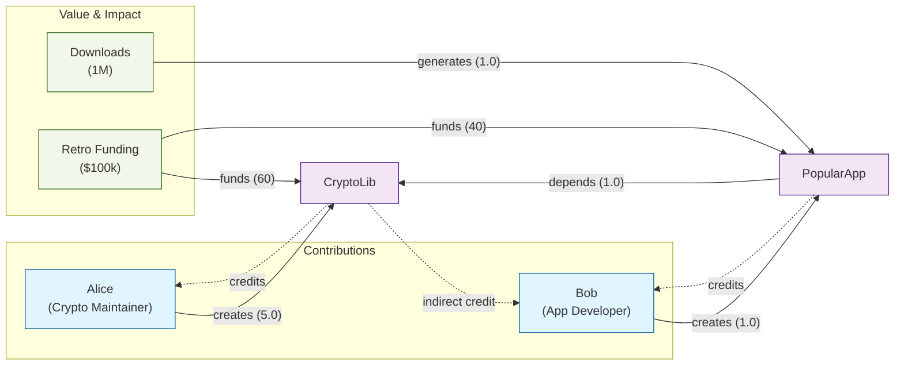
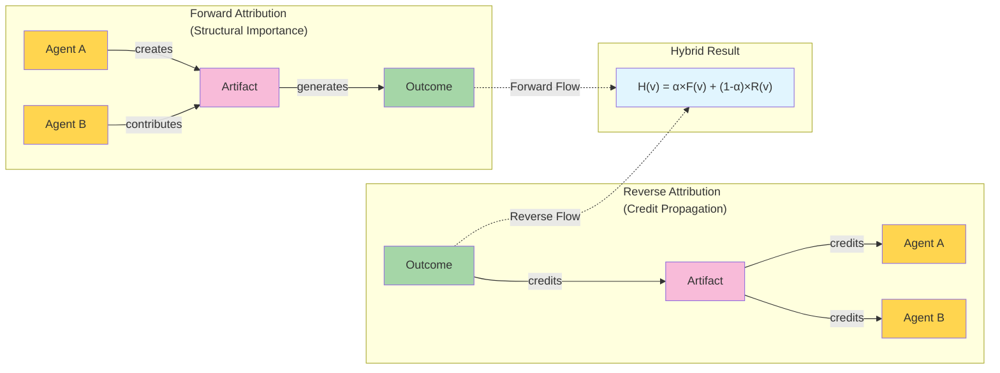
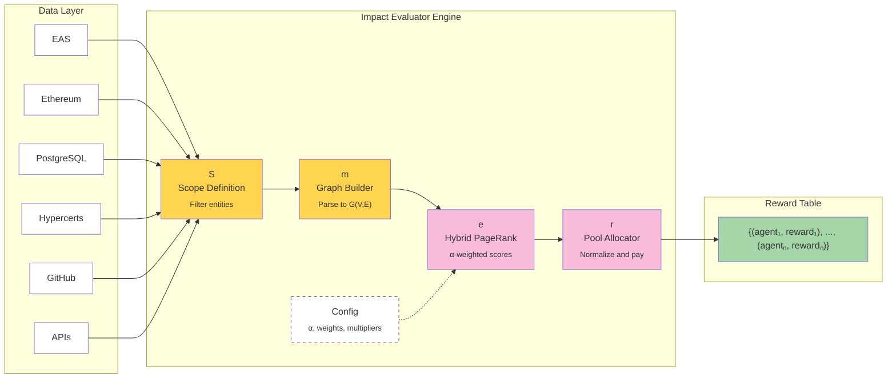

# A Hybrid PageRank Impact Evaluator

## Abstract

Existing funding systems often struggle to incentivize contributions to public and common goods because they lack mechanisms for coordinating diverse agents toward shared objectives[^1]. _The Generalized Impact Evaluators_ (GIE) framework proposes modular systems that retrospectively reward impact by measuring, evaluating, and distributing rewards to contributors[^1]. Building on this framework, we propose a graph‑based _Mechanism_ and _Impact Evaluator_ that models contributors, the intermediate results of their work (such as code, papers, or designs), and the eventual outcomes (like funding or citations) as a directed, weighted graph. Our model introduces a **hybrid attribution algorithm** combining forward PageRank and reverse (personalized) PageRank to estimate each agent’s contribution to observed outcomes. A tunable configuration object allows communities to adjust per‑edge and per‑node weights, making the model flexible and auditable. We describe how the graph, algorithm, and reward functions implement the GIE tuple $IE=\{r, e, m, S\}$, present illustrative use cases, and discuss extensions such as temporal decay, confidence scores, and decentralized attestation.

## 1 Introduction

### 1.1 The challenge of funding public goods

Public‑good projects often produce non‑excludable and non‑rivalrous benefits. Traditional funding systems—grants, venture capital, or philanthropic donations—frequently prioritize projects with clear cash flows or near‑term commercial return, leaving high‑uncertainty, high‑impact work underfunded[^1]. Retroactive Public Goods Funding (RetroPGF) schemes reward projects _after_ outcomes have been realized, but these schemes typically rely on subjective evaluations by a small group of voters[^2]. To scale such retrospective funding, we need automated systems that can measure, evaluate, and attribute impact across complex networks of contributors.

### 1.2 Generalized Impact Evaluators (GIEs)

The Generalized Impact Evaluators framework proposes a modular system for coordinating work by _measuring $(m)$_, _evaluating $(e)$_, and _rewarding $(r)$_ impact within a defined _scope $(S)$_. At a high level:

| Function              | Role                                                                                                               |
| --------------------- | ------------------------------------------------------------------------------------------------------------------ |
| **Scope ($S$)**       | Defines the set of entities (agents, artifacts, outcomes) and interactions considered in the evaluation.           |
| **Measurement ($m$)** | Collects data about contributions, activities, and observed value signals to build a representation of the system. |
| **Evaluation ($e$)**  | Computes relative importance of entities given the measured data.                                                  |
| **Reward ($r$)**      | Distributes a pool of resources proportionally according to evaluation scores.                                     |

Impact Evaluators can be implemented in various ways—expert committees, quadratic voting, or network‑based metrics. Hypercerts, for example, propose semi‑fungible tokens that capture scope of work, contributors, and impact on a decentralized ledger[^3]. Our work contributes a concrete implementation of the evaluation function (and associated measurement and reward functions) using graph theory and PageRank.

## 2 Related Work

### 2.1 Retroactive Public Goods Funding

RetroPGF programs, such as those pioneered by the Optimism Collective, distribute rewards based on demonstrated impact. Recent research notes that RetroPGF rewards blockchain projects according to _proven impact rather than future promises_ and highlights vulnerabilities in voting‑based reward schemes[^2]. Our network‑based evaluator offers an automated alternative that reduces reliance on subjective voting.

### 2.2 Hypercerts and decentralized attestations

Hypercerts, encode claims about work, contributors, and impact as semi‑fungible tokens on a shared smart‑contract standard[^3]. They provide an _interoperable data layer_ for different impact funding mechanisms, enabling retrospective funders to connect resources with measurable outcomes[^3]. Our evaluator can operate on hypercert claims or other attestations, serving as the “evaluation engine” that processes measurement data and outputs attribution scores.

### 2.3 Network centrality and PageRank

The PageRank algorithm assigns a numerical weight to each element in a hyperlinked set to measure its _relative importance_[^4]. It calculates importance by counting the number and quality of links to a node, under the assumption that nodes receiving many links from important nodes are themselves important[^4]. PageRank’s ideas have been applied beyond web pages to rank academic papers, social network participants, and molecules. Our hybrid algorithm adapts PageRank by combining a forward pass (in the direction of creation) with a reverse pass (flowing credit back from outcomes).

## 3 Model

### 3.1 Graph schema

We represent a contribution network as a directed, weighted, heterogeneous graph $G=(V,E)$ with three node types and arbitrary edge types:

| Node type    | Symbol | Examples                                                                               |
| ------------ | ------ | -------------------------------------------------------------------------------------- |
| **Agent**    | \(A\)  | People or organizations performing work—developers, researchers, artists, DAO members. |
| **Artifact** | \(B\)  | Tangible outputs or intermediaries—code repositories, academic papers, design assets.  |
| **Outcome**  | \(C\)  | Observed value signals—grants, citations, downloads, token mints, or other metrics.    |

Edges $E$ encode relationships between nodes and have a type, a weight, and an optional confidence score. Example edge types include:

- **Creation:** $A→B$ when an agent produces an artifact.
- **Contribution:** $A→C$ representing direct work toward an outcome (e.g., hours contributed).
- **Valuation:** $C→B$ when an outcome values an artifact (e.g., a grant awarded to a repository).
- **Attribution:** $C→A$ when value is directly attributed to an agent (e.g., citations or prizes).
- **Relation:** $B→B$ Artifact depends on, builds on, or cites another artifact.

Edges may be multiplied by domain‑specific weights to reflect their relative importance. Nodes may carry optional weights (e.g., external measures of importance) and metadata (e.g., categories, timestamps). This flexible schema allows unknown contributors: if we observe an outcome but cannot identify all contributors, the model still attributes influence via indirect connections.

### 3.2 Configurable weighting

A key design goal is to decouple the **graph structure** from the **calculation of scores**. The system accepts a _configuration object_ specifying:

- **Damping factor:** the PageRank damping parameter, typically 0.85, controlling random‑jump probability.
- **Hybrid balance ($a$):** balances forward influence propagation and reverse credit propagation; $a\in[0,1]$.
- **Edge‑type multipliers:** tuning parameters that dampen or amplify the contribution of each edge type.
- **Node‑type multipliers:** allow weighting agents, artifacts, or outcomes differently (e.g., boosting outcome nodes to emphasize realized value).
- **Per‑ID overrides:** optional multipliers for specific nodes.

These weights enable communities to “buff or nerf” activities, analogous to game design. Because the weights are external to the graph data, the same data can produce different attribution outcomes under different value systems.

### 3.3 Hybrid attribution algorithm

The hybrid evaluator computes a score for each **agent** by combining a _forward PageRank_ and a _reverse personalized PageRank_:

- **Forward rank (effort influence):** Run standard PageRank on the original graph to measure how agents and artifacts contribute to the network’s structure. This pass rewards nodes that participate in creation and are well‑connected.
- **Reverse rank (value propagation):** Reverse edges that originate from outcome nodes (so credit flows backward) and run a personalized PageRank. Personalization seeds are the outcome nodes; if no edges originate from an outcome, personalization weights are uniform across outcomes. Edge weights are multiplied by confidence and type multipliers.
- **Combine scores:** For each agent $v$, the final attribution score is:

$H(v) = \alpha\, PR_{\text{forward}}(v) + (1-\alpha)\, PR_{\text{reverse}}(v).$

Only agent nodes receive hybrid scores. A **reward function** normalizes these scores to sum to one and multiplies by a token pool to allocate rewards.

### 3.4 Implementation and code overview

We implement the evaluator in TypeScript using the _graphology_ library. A simplified overview is as follows:

- **Graph construction:** Build a directed graph from a list of nodes and edges, computing weights using configuration multipliers and confidence values.
- **Reverse graph:** Produce a separate graph in which edges from outcome nodes are not reversed (value flows outwards) but other edges are reversed (to propagate credit backward).
- **PageRank computation:** Use a modified PageRank function that accepts a personalization vector and custom edge weights. Compute a forward score and a reverse score.
- **Hybrid combination:** Apply the $a$-weighted combination for agent nodes and normalize scores for reward distribution.

The modular design allows external data sources to ingest into the graph. For example, GitHub commit data, grant payouts, EAS attestations, or hypercert events can be parsed into `(node, edge)` objects. Communities can adjust weights via governance processes, thereby fine‑tuning the evaluator without redeploying contracts.

## 4 Alignment with GIE Theory

Our model instantiates the GIE tuple $IE=\{r, e, m, S\}$ as follows:

- **Scope ($S$):** The scope is the set of agents, artifacts, and outcomes included in the graph. Temporal filters, project boundaries, or contextual metadata can restrict the scope.
- **Measurement ($m$):** Measurement consists of collecting data about contributions (creation, hours worked), outputs (artifacts), and observed outcomes (grants, citations). This data populates the graph’s nodes and edges.
- **Evaluation ($e$):** The hybrid PageRank algorithm computes evaluation scores for agents. It blends structural influence with proximity to demonstrated value and is configurable via $a$ and weight multipliers.
- **Reward ($r$):** The reward function distributes a token pool proportionally to agent scores. Because scores are normalized, the pool size can reflect available resources or be linked to the total value of outcomes.

By separating measurement, evaluation, and reward, the system allows different stakeholders to specialize. Data providers focus on measurement, algorithm designers on evaluation, and funders on reward distribution. Hypercerts or attestations can serve as measurement inputs, while tokens or on‑chain rewards implement the reward function.

## 5 Use Cases

### 5.1 Open source software

In an open‑source ecosystem, nodes correspond to developers, code repositories, and outcomes such as GitHub stars, grant awards, or downloads. Edges include commits (`developer → repo`), dependencies (`repo → repo`), grant funding (`grant → repo`), and citations (`grant → developer`). The evaluator identifies developers whose work is structurally influential and proximate to valued outcomes. Because the model is configurable, maintainers can boost or dampen edge types—e.g., emphasize actual funding over social signals.

### 5.2 Scientific research

Researchers (agents) produce papers (artifacts) that garner citations, grants, or media attention (outcomes). The hybrid algorithm attributes credit to both visible authors and hidden contributors (e.g., infrastructure developers) connected indirectly through citation and collaboration networks. Configurable weights allow a domain community to decide whether citations, grant funding, or open‑access downloads should carry more weight.

### 5.3 Creative industries and DAOs

Artists produce designs or music (artifacts) that are downloaded, remixed, or purchased (outcomes). In DAOs, contributors propose and implement governance decisions (artifacts) that result in treasury allocations (outcomes). The evaluator can incorporate on‑chain attestations (e.g., using the Ethereum Attestation Service) to permissionlessly record actions and outcomes. Participants can join the “open game” by submitting attestations; the graph grows organically, and the engine produces continuous attribution signals.

## 6 Discussion

### 6.1 Advantages

- **Automation and scalability:** By leveraging network algorithms, the evaluator reduces reliance on costly expert panels and scales to large networks. PageRank’s ability to assign importance based on link structure has been widely used in other domains[^4], suggesting that our approach can handle complex contribution graphs.
- **Flexibility and community governance:** Configuration parameters enable communities to express subjective value judgments. Weights can be tuned over time, similar to how game designers balance characters or weapons, without changing underlying data or code.
- **Auditability and transparency:** The graph provides an explicit, inspectable path of influence from outcomes back to agents. Stakeholders can trace how credit was assigned and adjust weights to counter gaming or biases.

### 6.2 Risks and limitations

- **Gaming:** Agents might create spam artifacts or outcomes to inflate their scores. The configuration must penalize low‑quality edges and incorporate confidence scores. Communities may need to combine algorithmic scores with human review.
- **Measurement gaps:** The evaluator only attributes value based on available data. Untracked contributions—like mentorship or off‑chain collaboration—will be ignored, potentially disadvantaging certain roles.
- **Weight setting:** Selecting appropriate edge and node weights is nontrivial. Poor choices may overemphasize certain activities or entrench biases. Governance mechanisms should be designed to update weights responsibly.
- **Temporal effects:** Without temporal decay, older contributions may dominate scores indefinitely. Introducing time‑decay functions or time‑windowed graphs can address this issue.

### 6.3 Extensions and future work

- **Temporal decay:** Apply exponential decay to edge weights to prioritize recent work and adapt to evolving ecosystems.
- **Uncertainty modeling:** Incorporate confidence scores that quantify uncertainty in causal links, allowing the algorithm to down‑weight low‑confidence edges.
- **Graph neural networks:** Explore machine‑learning techniques to learn attribution functions from data, potentially outperforming simple PageRank.
- **Integration with hypercerts:** Use hypercert claims as measurement data and allocate hypercert fractions as rewards, enhancing interoperability with other impact funding systems[^3].

### 6.4 Counterfactual analysis for attribution

Counterfactuals clarify how specific measurement channels (e.g., grants) alter the reward distribution. In our evaluator, counterfactuals are straightforward to compute by modifying the graph or configuration and re-running the hybrid score:

- Remove or down‑weight a subset of edges (e.g., `grant → *` edges) to estimate how payouts would change absent that value signal.
- Sweep the hybrid balance \(\alpha\) to bound structural vs. outcome-driven attributions: \(\alpha=1\) uses pure forward structure; \(\alpha=0\) emphasizes outcomes entirely.
- Adjust edge-type multipliers (e.g., dampen `depends`) to test sensitivity to assumptions about infrastructure leverage.

The included script `examples/grant-5000.ts` demonstrates a $5,000 allocation and reports a counterfactual where the grant channel is removed, printing \(\Delta\) payouts per agent. This operationalizes “what if the grant had not occurred?” as a practical diagnostic for governance and auditability.

## 7 Conclusion

We presented a graph‑based impact evaluator that implements the Generalized Impact Evaluator framework through a hybrid PageRank algorithm. By modeling agents, artifacts, and outcomes as nodes in a directed graph and tuning propagation weights via a configuration object, the evaluator offers a flexible, automated, and auditable method for attributing credit and distributing rewards. The model aligns with the GIE functions—_scope_, _measurement_, _evaluation_, and _reward_—and complements initiatives such as hypercerts and RetroPGF. Future work will refine weight selection, address gaming and measurement gaps, incorporate temporal dynamics, and integrate with decentralized attestation standards. Ultimately, such evaluators could form the backbone of open, permissionless ecosystems that incentivize high‑impact work for public and common goods.

## References

[^1]: Network Goods, "Generalized Impact Evaluators," Protocol Labs, Tech. Rep., 2023.
[^2]: Yu, J., Bennett, A., Gao, B., & Joseph, R. (2025). Evaluating Voting Design Vulnerabilities for Retroactive Funding. https://arxiv.org/abs/2505.16068
[^3]: Hypercerts Foundation (2023). Hypercerts. https://www.hypercerts.org/docs/whitepaper/whitepaper-intro
[^4]: Wikimedia Foundation. (n.d.). PageRank. Wikipedia. https://en.wikipedia.org/wiki/PageRank
